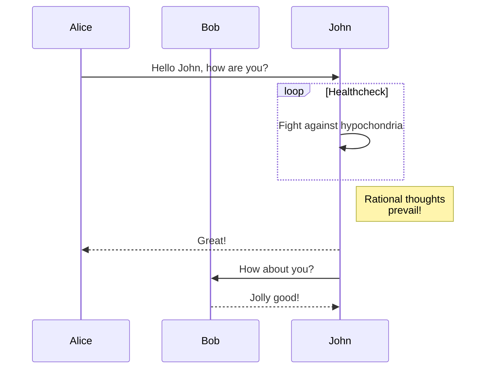

---
source: https://github.com/gohugoio/hugo/blob/master/docs/content/en/content-management/archetypes.md
---


## Overview

A content file consists of [front matter](g) and markup. The markup is typically Markdown, but Hugo also supports other [content formats](g). Front matter can be TOML, YAML, or JSON.

The `hugo new content` command creates a new file in the `content` directory, using an archetype as a template. This is the default archetype:


title = '{{ replace .File.ContentBaseName `-` ` ` | title }}'
date = '{{ .Date }}'
draft = true


When you create new content, Hugo evaluates the [template actions](g) within the archetype. For example:

```sh
hugo new content posts/my-first-post.md
```

With the default archetype shown above, Hugo creates this content file:


title = 'My First Post'
date = '2023-08-24T11:49:46-07:00'
draft = true


You can create an archetype for one or more [content types](g). For example, use one archetype for posts, and use the default archetype for everything else:

```tree
archetypes/
├── default.md
└── posts.md
```

## Lookup order

Hugo looks for archetypes in the `archetypes` directory in the root of your project, falling back to the `archetypes` directory in themes or installed modules. An archetype for a specific content type takes precedence over the default archetype.

For example, if you have enabled a theme named `my-theme` and you run this command:

```sh
hugo new content posts/my-first-post.md
```

The archetype lookup order is:

1. `archetypes/posts.md`
1. `themes/my-theme/archetypes/posts.md`
1. `archetypes/default.md`
1. `themes/my-theme/archetypes/default.md`

If none of these exists, Hugo uses a built-in default archetype.

## Functions and context

You can use any template [function](g) within an archetype. As shown above, the default archetype uses the [`strings.Replace`][] function to replace hyphens with spaces when populating the title in front matter.

Archetypes receive the following [context](g):

`Date`
: (`string`) The current date and time, formatted in compliance with RFC3339.

`File`
: (`hugolib.fileInfo`) Returns [file information][] for the current page.

`Type`
: (`string`) The [content type](g) inferred from the top-level directory name, or as specified by the `--kind` flag passed to the `hugo new content` command.

`Site`
: (`page.Site`) The current `Site` object.

## Date format

To insert date and time with a different format, use the [`time.Now`][] function:


title = '{{ replace .File.ContentBaseName `-` ` ` | title }}'
date = '{{ time.Now.Format "2006-01-02" }}'
draft = true


## Include content

Although typically used as a front matter template, you can also use an archetype to populate content.

For example, in a documentation site you might have a section (content type) for functions. Every page within this section should follow the same format: a brief description, the function signature, examples, and notes. We can pre-populate the page to remind content authors of the standard format.

````md {file="archetypes/functions.md"}

A brief description of what the function does, using simple present tense in the third person singular form. For example:

`someFunction` returns the string `s` repeated `n` times.

## Signature

```text
func someFunction(s string, n int) string
```

## Examples

One or more practical examples, each within a fenced code block.

## Notes

Additional information to clarify as needed.
````

Although you can include [template actions](g) within the content body, remember that Hugo evaluates these once---at the time of content creation. In most cases, place template actions in a [template](g) where Hugo evaluates the actions every time you [build](g) the site.

## Leaf bundles

You can also create archetypes for [leaf bundles](g).

For example, in a photography site you might have a section (content type) for galleries. Each gallery is leaf bundle with content and images.

Create an archetype for galleries:

```tree
archetypes/
├── galleries/
│   ├── images/
│   │   └── .gitkeep
│   └── index.md      <-- same format as default.md
└── default.md
```

Subdirectories within an archetype must contain at least one file. Without a file, Hugo will not create the subdirectory when you create new content. The name and size of the file are irrelevant. The example above includes a&nbsp;`.gitkeep` file, an empty file commonly used to preserve otherwise empty directories in a Git repository.

To create a new gallery:

```sh
hugo new galleries/bryce-canyon
```

This produces:

```tree
content/
├── galleries/
│   └── bryce-canyon/
│       ├── images/
│       │   └── .gitkeep
│       └── index.md
└── _index.md
```

## Specify archetype

Use the `--kind` command line flag to specify an archetype when creating content.

For example, let's say your site has two sections: articles and tutorials. Create an archetype for each content type:

```tree
archetypes/
├── articles.md
├── default.md
└── tutorials.md
```

To create an article using the articles archetype:

```sh
hugo new content articles/something.md
```

To create an article using the tutorials archetype:

```sh
hugo new content --kind tutorials articles/something.md
```

[`strings.Replace`]: /functions/strings/replace/
[`time.Now`]: /functions/time/now/
[file information]: /methods/page/file/


---
source: https://github.com/gohugoio/hugo/blob/master/docs/content/en/content-management/build-options.md
---


Build options are stored in a reserved front matter object named `build` with these defaults:


[build]
list = 'always'
publishResources = true
render = 'always'


`list`
: When to include the page within page collections. Specify one of:

  - `always`: Include the page in _all_ page collections. For example, `site.RegularPages`, `.Pages`, etc. This is the default value.
  - `local`: Include the page in _local_ page collections. For example, `.RegularPages`, `.Pages`, etc. Use this option to create fully navigable but headless content sections.
  - `never`: Do not include the page in _any_ page collection.

`publishResources`
: Applicable to [page bundles][], determines whether to publish the associated [page resources][]. Specify one of:

  - `true`: Always publish resources. This is the default value.
  - `false`: Only publish a resource when invoking its [`Permalink`][], [`RelPermalink`][], or [`Publish`][] method within a template.

`render`
: When to render the page. Specify one of:

  - `always`: Always render the page to disk. This is the default value.
  - `link`: Do not render the page to disk, but assign `Permalink` and `RelPermalink` values.
  - `never`: Never render the page to disk, and exclude it from all page collections.

> [!NOTE]
> Any page, regardless of its build options, will always be available by using the [`.Page.GetPage`][] or [`.Site.GetPage`][] method.

## Example -- headless page

Create a unpublished page whose content and resources can be included in other pages.

```tree
content/
├── headless/
│   ├── a.jpg
│   ├── b.jpg
│   └── index.md  <-- leaf bundle
└── _index.md     <-- home page
```

Set the build options in front matter:


title = 'Headless page'
[build]
  list = 'never'
  publishResources = false
  render = 'never'


To include the content and images on the home page:

```go-html-template {file="layouts/home.html"}
{{ with .Site.GetPage "/headless" }}
  {{ .Content }}
  {{ range .Resources.ByType "image" }}
    
  {{ end }}
{{ end }}
```

The published site will have this structure:

```tree
public/
├── headless/
│   ├── a.jpg
│   └── b.jpg
└── index.html
```

In the example above, note that:

1. Hugo did not publish an HTML file for the page.
1. Despite setting `publishResources` to `false` in front matter, Hugo published the [page resources][] because we invoked the [`RelPermalink`][] method on each resource. This is the expected behavior.

## Example -- headless section

Create a unpublished section whose content and resources can be included in other pages.

```tree
content/
├── headless/
│   ├── note-1/
│   │   ├── a.jpg
│   │   ├── b.jpg
│   │   └── index.md  <-- leaf bundle
│   ├── note-2/
│   │   ├── c.jpg
│   │   ├── d.jpg
│   │   └── index.md  <-- leaf bundle
│   └── _index.md     <-- branch bundle
└── _index.md         <-- home page
```

Set the build options in front matter, using the `cascade` keyword to "cascade" the values down to descendant pages.


title = 'Headless section'
[[cascade]]
[cascade.build]
  list = 'local'
  publishResources = false
  render = 'never'


In the front matter above, note that we have set `list` to `local` to include the descendant pages in local page collections.

To include the content and images on the home page:

```go-html-template {file="layouts/home.html"}
{{ with .Site.GetPage "/headless" }}
  {{ range .Pages }}
    {{ .Content }}
    {{ range .Resources.ByType "image" }}
      
    {{ end }}
  {{ end }}
{{ end }}
```

The published site will have this structure:

```tree
public/
├── headless/
│   ├── note-1/
│   │   ├── a.jpg
│   │   └── b.jpg
│   └── note-2/
│       ├── c.jpg
│       └── d.jpg
└── index.html
```

In the example above, note that:

1. Hugo did not publish an HTML file for the page.
1. Despite setting `publishResources` to `false` in front matter, Hugo correctly published the [page resources][] because we invoked the [`RelPermalink`][] method on each resource. This is the expected behavior.

## Example -- list without publishing

Publish a section page without publishing the descendant pages. For example, to create a glossary:

```tree
content/
├── glossary/
│   ├── _index.md
│   ├── bar.md
│   ├── baz.md
│   └── foo.md
└── _index.md
```

Set the build options in front matter, using the `cascade` keyword to "cascade" the values down to descendant pages.


title = 'Glossary'
[build]
render = 'always'
[[cascade]]
[cascade.build]
  list = 'local'
  publishResources = false
  render = 'never'


To render the glossary:

```go-html-template {file="layouts/glossary/section.html"}
<dl>
  {{ range .Pages }}
    <dt>{{ .Title }}</dt>
    <dd>{{ .Content }}</dd>
  {{ end }}
</dl>
```

The published site will have this structure:

```tree
public/
├── glossary/
│   └── index.html
└── index.html
```

## Example -- publish without listing

Publish a section's descendant pages without publishing the section page itself.

```tree
content/
├── books/
│   ├── _index.md
│   ├── book-1.md
│   └── book-2.md
└── _index.md
```

Set the build options in front matter:


title = 'Books'
[build]
render = 'never'
list = 'never'


The published site will have this structure:

```tree
public/
├── books/
│   ├── book-1/
│   │   └── index.html
│   └── book-2/
│       └── index.html
└── index.html
```

## Example -- conditionally hide section

Consider this example. A documentation site has a team of contributors with access to 20 custom shortcodes. Each shortcode takes several arguments, and requires documentation for the contributors to reference when using them.

Instead of external documentation for the shortcodes, include an `internal` section that is hidden when building the production site.

```tree
content/
├── internal/
│   ├── shortcodes/
│   │   ├── _index.md
│   │   ├── shortcode-1.md
│   │   └── shortcode-2.md
│   └── _index.md
├── reference/
│   ├── _index.md
│   ├── reference-1.md
│   └── reference-2.md
├── tutorials/
│   ├── _index.md
│   ├── tutorial-1.md
│   └── tutorial-2.md
└── _index.md
```

Set the build options in front matter, using the `cascade` keyword to "cascade" the values down to descendant pages, and use the `target` keyword to target the production environment.


title = 'Internal'
[[cascade]]
[cascade.build]
render = 'never'
list = 'never'
[cascade.target]
environment = 'production'


The production site will have this structure:

```tree
public/
├── reference/
│   ├── reference-1/
│   │   └── index.html
│   ├── reference-2/
│   │   └── index.html
│   └── index.html
├── tutorials/
│   ├── tutorial-1/
│   │   └── index.html
│   ├── tutorial-2/
│   │   └── index.html
│   └── index.html
└── index.html
```

[`.Page.GetPage`]: /methods/page/getpage/
[`.Site.GetPage`]: /methods/site/getpage/
[`Permalink`]: /methods/resource/permalink/
[`Publish`]: /methods/resource/publish/
[`RelPermalink`]: /methods/resource/relpermalink/
[page bundles]: /content-management/page-bundles/
[page resources]: /content-management/page-resources/


---
source: https://github.com/gohugoio/hugo/blob/master/docs/content/en/content-management/comments.md
---


Hugo ships with support for [Disqus][], a third-party service that provides comment and community capabilities to websites via JavaScript.

Your theme may already support Disqus, but if not, it is easy to add to your templates via Hugo's [embedded partial][].

## Add Disqus

Hugo comes with all the code you need to load Disqus into your templates. Before adding Disqus to your site, you'll need to [set up an account][].

### Configure Disqus

Disqus comments require you set a single value in your project configuration:


[services.disqus]
shortname = 'your-disqus-shortname'


For many websites, this is enough configuration. However, you also have the option to set the following in the front matter of a single content file:

- `params.disqus_identifier`
- `params.disqus_title`
- `params.disqus_url`

### Render Hugo's embedded Disqus partial

To render it, add the following code where you want comments to appear:

```go-html-template
{{ partial "disqus.html" . }}
```

## Alternatives

Commercial commenting systems:

- [Commentix][]
- [Emote][]
- [FastComments][]
- [Graph Comment][]
- [Hyvor Talk][]
- [IntenseDebate][]
- [ReplyBox][]

Open-source commenting systems:

- [Cactus Comments][]
- [Comentario][]
- [Comma][]
- [Discourse][]
- [Giscus][]
- [Isso][]
- [Remark42][]
- [Staticman][]
- [Talkyard][]
- [Utterances][]
- [Zoomment][]

[Cactus Comments]: https://cactus.chat/docs/integrations/hugo/
[Comentario]: https://gitlab.com/comentario/comentario/
[Comma]: https://github.com/Dieterbe/comma/
[Commentix]: https://www.commentix.com/
[Discourse]: https://meta.discourse.org/t/embed-discourse-comments-on-another-website-via-javascript/31963
[Disqus]: https://disqus.com/
[Emote]: https://emote.com/
[FastComments]: https://fastcomments.com/commenting-system-for-hugo
[Giscus]: https://giscus.app/
[Graph Comment]: https://graphcomment.com/
[Hyvor Talk]: https://talk.hyvor.com/
[IntenseDebate]: https://intensedebate.com/
[Isso]: https://isso-comments.de/
[Remark42]: https://remark42.com/
[ReplyBox]: https://getreplybox.com/
[Staticman]: https://staticman.net/
[Talkyard]: https://blog-comments.talkyard.io/
[Utterances]: https://utteranc.es/
[Zoomment]: https://zoomment.com/
[embedded partial]: /templates/embedded/#disqus
[set up an account]: https://disqus.com/profile/signup/


---
source: https://github.com/gohugoio/hugo/blob/master/docs/content/en/content-management/content-adapters.md
---


## Overview

A content adapter is a template that dynamically creates pages when building a site. For example, use a content adapter to create pages from a remote data source such as JSON, TOML, YAML, or XML.

Unlike templates that reside in the `layouts` directory, content adapters reside in the `content` directory, no more than one per directory per language. When a content adapter creates a page, the page's [logical path](g) will be relative to the content adapter.

```tree
content/
├── articles/
│   ├── _index.md
│   ├── article-1.md
│   └── article-2.md
├── books/
│   ├── _content.gotmpl  <-- content adapter
│   └── _index.md
└── films/
    ├── _content.gotmpl  <-- content adapter
    └── _index.md
```

Each content adapter is named `_content.gotmpl` and uses the same [syntax][] as templates in the `layouts` directory. You can use any of the [template functions][] within a content adapter, as well as the methods described below.

## Methods

Use these methods within a content adapter.

`AddPage`
: Adds a page to the site.

  ```go-html-template {file="content/books/_content.gotmpl"}
  {{ $content := dict
    "mediaType" "text/markdown"
    "value" "The _Hunchback of Notre Dame_ was written by Victor Hugo."
  }}
  {{ $page := dict
    "content" $content
    "kind" "page"
    "path" "the-hunchback-of-notre-dame"
    "title" "The Hunchback of Notre Dame"
  }}
  {{ .AddPage $page }}
  ```

`AddResource`
: Adds a page resource to the site.

  ```go-html-template {file="content/books/_content.gotmpl"}
  {{ with resources.Get "images/a.jpg" }}
    {{ $content := dict
      "mediaType" .MediaType.Type
      "value" .
    }}
    {{ $resource := dict
      "content" $content
      "path" "the-hunchback-of-notre-dame/cover.jpg"
    }}
    {{ $.AddResource $resource }}
  {{ end }}
  ```

  Then retrieve the new page resource with something like:

  ```go-html-template {file="layouts/page.html"}
  {{ with .Resources.Get "cover.jpg" }}
    
  {{ end }}
  ```

`Site`
: (`Site`) Returns the site to which the pages will be added.

  ```go-html-template {file="content/books/_content.gotmpl"}
  {{ .Site.Title }}
  ```

  > [!NOTE]
  > The `Site` object is not fully initialized while Hugo executes a content adapter.
  > Methods that depend on built pages, such as `Site.Pages`, are unavailable at this stage and return an error.

`Store`
: (`maps.Scratch`) Returns a persistent data structure for storing and manipulating keyed values. The main use case for this is to transfer values between executions when [EnableAllLanguages](#enablealllanguages) is set. See [examples][].

  ```go-html-template {file="content/books/_content.gotmpl"}
  {{ .Store.Set "key" "value" }}
  {{ .Store.Get "key" }}
  ```

`EnableAllLanguages`
: By default, Hugo executes the content adapter only once for the first matching site in the [sites matrix](g). Use this method to expand execution to all languages while maintaining the current role and version.

  For more fine-grained control, define a `sites.matrix` in front matter or in a content mount.

  ```go-html-template {file="content/books/_content.gotmpl"}
  {{ .EnableAllLanguages }}
  {{ $content := dict
    "mediaType" "text/markdown"
    "value" "The _Hunchback of Notre Dame_ was written by Victor Hugo."
  }}
  {{ $page := dict
    "content" $content
    "kind" "page"
    "path" "the-hunchback-of-notre-dame"
    "title" "The Hunchback of Notre Dame"
  }}
  {{ .AddPage $page }}
  ```

`EnableAllDimensions`
: By default, Hugo executes the content adapter only once for the first matching site in the [sites matrix](g). Use this method to expand execution to every possible combination of language, version, and role.

  For more fine-grained control, define a `sites.matrix` in front matter or in a content mount.

## Page map

Set any [front matter field][] in the map passed to the [`AddPage`](#addpage) method, excluding `markup`. Instead of setting the `markup` field, specify the `content.mediaType` as described below.

This table describes the fields most commonly passed to the `AddPage` method.

Key|Description|Required
:--|:--|:-:
`content.mediaType`|The content [media type][]. Default is `text/markdown`. See [content formats][] for examples.|&nbsp;
`content.value`|The content value as a string.|&nbsp;
`dates.date`|The page creation date as a `time.Time` value.|&nbsp;
`dates.expiryDate`|The page expiry date as a `time.Time` value.|&nbsp;
`dates.lastmod`|The page last modification date as a `time.Time` value.|&nbsp;
`dates.publishDate`|The page publication date as a `time.Time` value.|&nbsp;
`params`|A map of page parameters.|&nbsp;
`path`|The page's [logical path](g) relative to the content adapter. Do not include a leading slash or file extension.|:heavy_check_mark:
`title`|The page title.|&nbsp;

> [!NOTE]
> While `path` is the only required field, we recommend setting `title` as well.
>
> When setting the `path`, Hugo transforms the given string to a logical path. For example, setting `path` to `A B C` produces a logical path of `/section/a-b-c`.

## Resource map

Construct the map passed to the [`AddResource`](#addresource) method using the fields below.

Key|Description|Required
:--|:--|:-:
`content.mediaType`|The content [media type][].|:heavy_check_mark:
`content.value`|The content value as a string or resource.|:heavy_check_mark:
`name`|The resource name.|&nbsp;
`params`|A map of resource parameters.|&nbsp;
`path`|The resources's [logical path](g) relative to the content adapter. Do not include a leading slash.|:heavy_check_mark:
`title`|The resource title.|&nbsp;

> [!NOTE]
> When `content.value` is a string, Hugo generates a new resource with a publication path relative to the page. However, if `content.value` is already a resource, Hugo directly uses its value and publishes it relative to the site root. This latter method is more efficient.
>
> When setting the `path`, Hugo transforms the given string to a logical path. For example, setting `path` to `A B C/cover.jpg` produces a logical path of `/section/a-b-c/cover.jpg`.

## Example

Create pages from remote data, where each page represents a book review.

Step 1
: Create the content structure.

  ```tree
  content/
  └── books/
      ├── _content.gotmpl  <-- content adapter
      └── _index.md
  ```

Step 2
: Inspect the remote data to determine how to map key-value pairs to front matter fields.\
  <https://gohugo.io/shared/examples/data/books.json>

Step 3
: Create the content adapter.

  ```go-html-template {file="content/books/_content.gotmpl" copy=true}
  {{/* Get remote data. */}}
  {{ $data := dict }}
  {{ $url := "https://gohugo.io/shared/examples/data/books.json" }}
  {{ with try (resources.GetRemote $url) }}
    {{ with .Err }}
      {{ errorf "Unable to get remote resource %s: %s" $url . }}
    {{ else with .Value }}
      {{ $data = . | transform.Unmarshal }}
    {{ else }}
      {{ errorf "Unable to get remote resource %s" $url }}
    {{ end }}
  {{ end }}

  {{/* Add pages and page resources. */}}
  {{ range $data }}

    {{/* Add page. */}}
    {{ $content := dict "mediaType" "text/markdown" "value" .summary }}
    {{ $dates := dict "date" (time.AsTime .date) }}
    {{ $params := dict "author" .author "isbn" .isbn "rating" .rating "tags" .tags }}
    {{ $page := dict
      "content" $content
      "dates" $dates
      "kind" "page"
      "params" $params
      "path" .title
      "title" .title
    }}
    {{ $.AddPage $page }}

    {{/* Add page resource. */}}
    {{ $item := . }}
    {{ with $url := $item.cover }}
      {{ with try (resources.GetRemote $url) }}
        {{ with .Err }}
          {{ errorf "Unable to get remote resource %s: %s" $url . }}
        {{ else with .Value }}
          {{ $content := dict "mediaType" .MediaType.Type "value" .Content }}
          {{ $params := dict "alt" $item.title }}
          {{ $resource := dict
            "content" $content
            "params" $params
            "path" (printf "%s/cover.%s" $item.title .MediaType.SubType)
          }}
          {{ $.AddResource $resource }}
        {{ else }}
          {{ errorf "Unable to get remote resource %s" $url }}
        {{ end }}
      {{ end }}
    {{ end }}

  {{ end }}
  ```

Step 4
: Create a _page_ template to render each book review.

  ```go-html-template {file="layouts/books/page.html" copy=true}
  {{ define "main" }}
    <h1>{{ .Title }}</h1>

    {{ with .Resources.GetMatch "cover.*" }}
      
    {{ end }}

    <p>Author: {{ .Params.author }}</p>

    <p>
      ISBN: {{ .Params.isbn }}<br>
      Rating: {{ .Params.rating }}<br>
      Review date: {{ .Date | time.Format ":date_long" }}
    </p>

    {{ with .GetTerms "tags" }}
      <p>Tags:</p>
      <ul>
        {{ range . }}
          <li><a href="{{ .RelPermalink }}">{{ .LinkTitle }}</a></li>
        {{ end }}
      </ul>
    {{ end }}

    {{ .Content }}
  {{ end }}
  ```

## Multilingual projects

With multilingual projects you can:

1. Create one content adapter for all languages using the [`EnableAllLanguages`](#enablealllanguages) method as described above.
1. Create content adapters unique to each language. See the examples below.

### Translations by file name

With this project configuration:


[languages.en]
weight = 1

[languages.de]
weight = 2


Include a language designator in the content adapter's file name.

```tree
content/
└── books/
    ├── _content.de.gotmpl
    ├── _content.en.gotmpl
    ├── _index.de.md
    └── _index.en.md
```

### Translations by content directory

With this project configuration:


[languages.en]
contentDir = 'content/en'
weight = 1

[languages.de]
contentDir = 'content/de'
weight = 2


Create a single content adapter in each directory:

```tree
content/
├── de/
│   └── books/
│       ├── _content.gotmpl
│       └── _index.md
└── en/
    └── books/
        ├── _content.gotmpl
        └── _index.md
```

## Page collisions

Two or more pages collide when they have the same publication path. Due to concurrency, the content of the published page is indeterminate. Consider this example:

```tree
content/
└── books/
    ├── _content.gotmpl  <-- content adapter
    ├── _index.md
    └── the-hunchback-of-notre-dame.md
```

If the content adapter also creates `books/the-hunchback-of-notre-dame`, the content of the published page is indeterminate. You can not define the processing order.

To detect page collisions, use the `--printPathWarnings` flag when building your project.

[content formats]: /content-management/formats/#classification
[examples]: /methods/page/store/
[front matter field]: /content-management/front-matter/#fields
[media type]: https://en.wikipedia.org/wiki/Media_type
[syntax]: /templates/introduction/
[template functions]: /functions/


---
source: https://github.com/gohugoio/hugo/blob/master/docs/content/en/content-management/data-sources.md
---


Hugo can access and [unmarshal](g) local and remote data sources including CSV, JSON, TOML, YAML, and XML. Use this data to augment existing content or to create new content.

A data source might be a file in the `data` directory, a [global resource](g), a [page resource](g), or a [remote resource](g).

## Data directory

The `data` directory in the root of your project may contain one or more data files, in either a flat or nested tree. Hugo merges the data files to create a single data structure, accessible with the `Data` method on a `Site` object.

Hugo also merges data directories from themes and modules into this single data structure, where the `data` directory in the root of your project takes precedence.

> [!NOTE]
> Hugo reads the combined data structure into memory and keeps it there for the entire build. For data that is infrequently accessed, use global or page resources instead.

Theme and module authors may wish to namespace their data files to prevent collisions. For example:

```tree
project/
└── data/
    └── mytheme/
        └── foo.json
```

> [!NOTE]
> Do not place CSV files in the `data` directory. Access CSV files as page, global, or remote resources.

See the documentation for the [`Data`][] method on a `Site` object for details and examples.

## Global resources

Use the `resources.Get` and `transform.Unmarshal` functions to access data files that exist as global resources.

See the [`transform.Unmarshal`][global-resource] documentation for details and examples.

## Page resources

Use the `Resources.Get` method on a `Page` object combined with the `transform.Unmarshal` function to access data files that exist as page resources.

See the [`transform.Unmarshal`][page-resource] documentation for details and examples.

## Remote resources

Use the `resources.GetRemote` and `transform.Unmarshal` functions to access remote data.

See the [`transform.Unmarshal`][remote-resource] documentation for details and examples.

## Augment existing content

Use data sources to augment existing content. For example, create a shortcode to render an HTML table from a global CSV resource.

```csv {file="assets/pets.csv"}
"name","type","breed","age"
"Spot","dog","Collie","3"
"Felix","cat","Malicious","7"
```

```md {file="content/example.md"}

```

```go-html-template {file="layouts/_shortcodes/csv-to-table.html"}
{{ with $file := .Get 0 }}
  {{ with resources.Get $file }}
    {{ with . | transform.Unmarshal }}
      <table>
        <thead>
          <tr>
            {{ range index . 0 }}
              <th>{{ . }}</th>
            {{ end }}
          </tr>
        </thead>
        <tbody>
          {{ range after 1 . }}
            <tr>
              {{ range . }}
                <td>{{ . }}</td>
              {{ end }}
            </tr>
          {{ end }}
        </tbody>
      </table>
    {{ end }}
  {{ else }}
    {{ errorf "The %q shortcode was unable to find %s. See %s" $.Name $file $.Position }}
  {{ end }}
{{ else }}
  {{ errorf "The %q shortcode requires one positional argument, the path to the CSV file relative to the assets directory. See %s" .Name .Position }}
{{ end }}
```

Hugo renders this to:

name|type|breed|age
:--|:--|:--|:--
Spot|dog|Collie|3
Felix|cat|Malicious|7

## Create new content

Use [content adapters][] to create new content.

[`Data`]: /methods/site/data/
[content adapters]: /content-management/content-adapters/
[global-resource]: /functions/transform/unmarshal/#global-resource
[page-resource]: /functions/transform/unmarshal/#page-resource
[remote-resource]: /functions/transform/unmarshal/#remote-resource


---
source: https://github.com/gohugoio/hugo/blob/master/docs/content/en/content-management/diagrams.md
---


## GoAT diagrams (ASCII)

Hugo natively supports [GoAT][] diagrams with an [embedded code block render hook][]. This means that this code block:

````txt
```goat
      .               .                .               .--- 1          .-- 1     / 1
     / \              |                |           .---+            .-+         +
    /   \         .---+---.         .--+--.        |   '--- 2      |   '-- 2   / \ 2
   +     +        |       |        |       |    ---+            ---+          +
  / \   / \     .-+-.   .-+-.     .+.     .+.      |   .--- 3      |   .-- 3   \ / 3
 /   \ /   \    |   |   |   |    |   |   |   |     '---+            '-+         +
 1   2 3   4    1   2   3   4    1   2   3   4         '--- 4          '-- 4     \ 4

```
````

Will be rendered as:

```goat

          .               .                .               .--- 1          .-- 1     / 1
         / \              |                |           .---+            .-+         +
        /   \         .---+---.         .--+--.        |   '--- 2      |   '-- 2   / \ 2
       +     +        |       |        |       |    ---+            ---+          +
      / \   / \     .-+-.   .-+-.     .+.     .+.      |   .--- 3      |   .-- 3   \ / 3
     /   \ /   \    |   |   |   |    |   |   |   |     '---+            '-+         +
     1   2 3   4    1   2   3   4    1   2   3   4         '--- 4          '-- 4     \ 4
```

## Mermaid diagrams

Hugo does not provide a built-in template for Mermaid diagrams. Create your own using a [code block render hook][]:

```go-html-template {file="layouts/_markup/render-codeblock-mermaid.html" copy=true}
<pre class="mermaid">
  {{ .Inner | htmlEscape | safeHTML }}
</pre>
{{ .Page.Store.Set "hasMermaid" true }}
```

Then include this snippet at the _bottom_ of your base template, before the closing `body` tag:

```go-html-template {file="layouts/baseof.html" copy=true}
{{ if .Store.Get "hasMermaid" }}
  <script type="module">
    import mermaid from 'https://cdn.jsdelivr.net/npm/mermaid/dist/mermaid.esm.min.mjs';
    mermaid.initialize({ startOnLoad: true });
  </script>
{{ end }}
```

With that you can use the `mermaid` language in Markdown code blocks:

````md {file="content/example.md" copy=true}

````

## Goat ASCII diagram examples

### Graphics

```goat
                                                                             .
    0       3                          P *              Eye /         ^     /
     *-------*      +y                    \                +)          \   /  Reflection
  1 /|    2 /|       ^                     \                \           \ v
   *-------* |       |                v0    \       v3           --------*--------
   | |4    | |7      |                  *----\-----*
   | *-----|-*       +-----> +x        /      v X   \          .-.<--------        o
   |/      |/       /                 /        o     \        | / | Refraction    / \
   *-------*       v                 /                \        +-'               /   \
  5       6      +z              v1 *------------------* v2    |                o-----o
                                                               v

```

### Complex

```goat
+-------------------+                           ^                      .---.
|    A Box          |__.--.__    __.-->         |      .-.             |   |
|                   |        '--'               v     | * |<---        |   |
+-------------------+                                  '-'             |   |
                       Round                                       *---(-. |
  .-----------------.  .-------.    .----------.         .-------.     | | |
 |   Mixed Rounded  | |         |  / Diagonals  \        |   |   |     | | |
 | & Square Corners |  '--. .--'  /              \       |---+---|     '-)-'       .--------.
 '--+------------+-'  .--. |     '-------+--------'      |   |   |       |        / Search /
    |            |   |    | '---.        |               '-------'       |       '-+------'
    |<---------->|   |    |      |       v                Interior                 |     ^
    '           <---'      '----'   .-----------.              ---.     .---       v     |
 .------------------.  Diag line    | .-------. +---.              \   /           .     |
 |   if (a > b)     +---.      .--->| |       | |    | Curved line  \ /           / \    |
 |   obj->fcn()     |    \    /     | '-------' |<--'                +           /   \   |
 '------------------'     '--'      '--+--------'      .--. .--.     |  .-.     +Done?+-'
    .---+-----.                        |   ^           |\ | | /|  .--+ |   |     \   /
    |   |     | Join        \|/        |   | Curved    | \| |/ | |    \    |      \ /
    |   |     +---->  o    --o--        '-'  Vertical  '--' '--'  '--  '--'        +  .---.
 <--+---+-----'       |     /|\                                                    |  | 3 |
                      v                             not:line    'quotes'        .-'   '---'
  .-.             .---+--------.            /            A || B   *bold*       |        ^
 |   |           |   Not a dot  |      <---+---<--    A dash--is not a line    v        |
  '-'             '---------+--'          /           Nor/is this.            ---

```

### Process

```goat
                                      .
   .---------.                       / \
  |   START   |                     /   \        .-+-------+-.      ___________
   '----+----'    .-------.    A   /     \   B   | |COMPLEX| |     /           \      .-.
        |        |   END   |<-----+CHOICE +----->| |       | +--->+ PREPARATION +--->| X |
        v         '-------'        \     /       | |PROCESS| |     \___________/      '-'
    .---------.                     \   /        '-+---+---+-'
   /  INPUT  /                       \ /
  '-----+---'                         '
        |                             ^
        v                             |
  .-----------.                 .-----+-----.        .-.
  |  PROCESS  +---------------->|  PROCESS  |<------+ X |
  '-----------'                 '-----------'        '-'
```

### File tree

Created from <https://arthursonzogni.com/Diagon/#Tree>

```goat  {width=300 color="orange"}
───Linux─┬─Android
         ├─Debian─┬─Ubuntu─┬─Lubuntu
         │        │        ├─Kubuntu
         │        │        ├─Xubuntu
         │        │        └─Xubuntu
         │        └─Mint
         ├─Centos
         └─Fedora
```

### Sequence diagram

<https://arthursonzogni.com/Diagon/#Sequence>

```goat {class="w-40"}
┌─────┐       ┌───┐
│Alice│       │Bob│
└──┬──┘       └─┬─┘
   │            │  
   │ Hello Bob! │  
   │───────────>│  
   │            │  
   │Hello Alice!│  
   │<───────────│  
┌──┴──┐       ┌─┴─┐
│Alice│       │Bob│
└─────┘       └───┘

```

### Flowchart

<https://arthursonzogni.com/Diagon/#Flowchart>

```goat
   _________________                                                              
  ╱                 ╲                                                     ┌─────┐ 
 ╱ DO YOU UNDERSTAND ╲____________________________________________________│GOOD!│ 
 ╲ FLOW CHARTS?      ╱yes                                                 └──┬──┘ 
  ╲_________________╱                                                        │    
           │no                                                               │    
  _________▽_________                    ______________________              │    
 ╱                   ╲                  ╱                      ╲    ┌────┐   │    
╱ OKAY, YOU SEE THE   ╲________________╱ ... AND YOU CAN SEE    ╲___│GOOD│   │    
╲ LINE LABELED 'YES'? ╱yes             ╲ THE ONES LABELED 'NO'? ╱yes└──┬─┘   │    
 ╲___________________╱                  ╲______________________╱       │     │    
           │no                                     │no                 │     │    
   ________▽_________                     _________▽__________         │     │    
  ╱                  ╲    ┌───────────┐  ╱                    ╲        │     │    
 ╱ BUT YOU SEE THE    ╲___│WAIT, WHAT?│ ╱ BUT YOU JUST         ╲___    │     │    
 ╲ ONES LABELED 'NO'? ╱yes└───────────┘ ╲ FOLLOWED THEM TWICE? ╱yes│   │     │    
  ╲__________________╱                   ╲____________________╱    │   │     │    
           │no                                     │no             │   │     │    
       ┌───▽───┐                                   │               │   │     │    
       │LISTEN.│                                   └───────┬───────┘   │     │    
       └───┬───┘                                    ┌──────▽─────┐     │     │    
     ┌─────▽────┐                                   │(THAT WASN'T│     │     │    
     │I HATE YOU│                                   │A QUESTION) │     │     │    
     └──────────┘                                   └──────┬─────┘     │     │    
                                                      ┌────▽───┐       │     │    
                                                      │SCREW IT│       │     │    
                                                      └────┬───┘       │     │    
                                                           └─────┬─────┘     │    
                                                                 │           │    
                                                                 └─────┬─────┘    
                                                               ┌───────▽──────┐   
                                                               │LET'S GO DRING│   
                                                               └───────┬──────┘   
                                                             ┌─────────▽─────────┐
                                                             │HEY, I SHOULD TRY  │
                                                             │INSTALLING FREEBSD!│
                                                             └───────────────────┘

```

### Table

<https://arthursonzogni.com/Diagon/#Table>

```goat {class="w-80 dark-blue"}
┌────────────────────────────────────────────────┐
│                                                │
├────────────────────────────────────────────────┤
│SYNTAX     = { PRODUCTION } .                   │
├────────────────────────────────────────────────┤
│PRODUCTION = IDENTIFIER "=" EXPRESSION "." .    │
├────────────────────────────────────────────────┤
│EXPRESSION = TERM { "|" TERM } .                │
├────────────────────────────────────────────────┤
│TERM       = FACTOR { FACTOR } .                │
├────────────────────────────────────────────────┤
│FACTOR     = IDENTIFIER                         │
├────────────────────────────────────────────────┤
│          | LITERAL                             │
├────────────────────────────────────────────────┤
│          | "[" EXPRESSION "]"                  │
├────────────────────────────────────────────────┤
│          | "(" EXPRESSION ")"                  │
├────────────────────────────────────────────────┤
│          | "{" EXPRESSION "}" .                │
├────────────────────────────────────────────────┤
│IDENTIFIER = letter { letter } .                │
├────────────────────────────────────────────────┤
│LITERAL    = """" character { character } """" .│
└────────────────────────────────────────────────┘
```

[GoAT]: https://github.com/bep/goat
[code block render hook]: /render-hooks/code-blocks/
[embedded code block render hook]: <{}>


---
source: https://github.com/gohugoio/hugo/blob/master/docs/content/en/content-management/formats.md
---


## Introduction

You may mix content formats throughout your site. For example:

```tree
content/
└── posts/
    ├── post-1.md
    ├── post-2.adoc
    ├── post-3.org
    ├── post-4.pandoc
    ├── post-5.rst
    └── post-6.html
```

Regardless of content format, all content must have [front matter][], preferably including both `title` and `date`.

Hugo selects the content renderer based on the `markup` identifier in front matter, falling back to the file extension. See the [classification](#classification) table below for a list of markup identifiers and recognized file extensions.

## Formats

### Markdown

Create your content in [Markdown][] preceded by front matter.

Markdown is Hugo's default content format. Hugo natively renders Markdown to HTML using [Goldmark][]. Goldmark is fast and conforms to the [CommonMark][] and [GitHub Flavored Markdown][] specifications. You can configure Goldmark in your [project configuration][configure goldmark].

Hugo provides custom Markdown features including:

[Attributes][]
: Apply HTML attributes such as `class` and `id` to Markdown images and block elements including blockquotes, fenced code blocks, headings, horizontal rules, lists, paragraphs, and tables.

[Extensions][]
: Leverage the embedded Markdown extensions to create tables, definition lists, footnotes, task lists, inserted text, mark text, subscripts, superscripts, and more.

[Mathematics][]
: Include mathematical equations and expressions in Markdown using LaTeX markup.

[Render hooks][]
: Override the conversion of Markdown to HTML when rendering fenced code blocks, headings, images, and links. For example, render every standalone image as an HTML `figure` element.

### HTML

Create your content in [HTML][] preceded by front matter. The content is typically what you would place within an HTML document's `body` or `main` element.

> [!NOTE]
> The HTML content format is denied by default. See [`security.allowContent`][].

### Emacs Org Mode

Create your content in the [Emacs Org Mode][] format preceded by front matter. You can use Org Mode keywords for front matter. See [details][].

### AsciiDoc

Create your content in the [AsciiDoc][] format preceded by front matter. Hugo renders AsciiDoc content to HTML using the Asciidoctor executable. You must install Asciidoctor and its dependencies (Ruby) to render the AsciiDoc content format.

You can configure the AsciiDoc renderer in your [project configuration][configure asciidoc].

In its default configuration, Hugo passes these CLI flags when calling the Asciidoctor executable:

```sh
--no-header-footer
```

The CLI flags passed to the Asciidoctor executable depend on configuration. You may inspect the flags when building your project:

```sh
hugo build --logLevel info
```

### Pandoc

Create your content in the [Pandoc][] format preceded by front matter. Hugo renders Pandoc content to HTML using the Pandoc executable. You must install Pandoc to render the Pandoc content format.

Hugo passes these CLI flags when calling the Pandoc executable:

```sh
--mathjax
```

### reStructuredText

Create your content in the [reStructuredText][] format preceded by front matter. Hugo renders reStructuredText content to HTML using [Docutils][], specifically rst2html. You must install Docutils and its dependencies (Python) to render the reStructuredText content format.

Hugo passes these CLI flags when calling the rst2html executable:

```sh
--leave-comments --initial-header-level=2
```

## Classification

{}

When converting content to HTML, Hugo uses:

- Native renderers for Markdown, HTML, and Emacs Org mode
- External renderers for AsciiDoc, Pandoc, and reStructuredText

Native renderers are faster than external renderers.

[AsciiDoc]: https://asciidoc.org/
[Attributes]: /content-management/markdown-attributes/
[CommonMark]: https://spec.commonmark.org/current/
[Docutils]: https://docutils.sourceforge.io/
[Emacs Org Mode]: https://orgmode.org/
[Extensions]: /configuration/markup/#extensions
[GitHub Flavored Markdown]: https://github.github.com/gfm/
[Goldmark]: https://github.com/yuin/goldmark
[HTML]: https://developer.mozilla.org/en-US/docs/Learn_web_development/Getting_started/Your_first_website/Creating_the_content
[Markdown]: https://daringfireball.net/projects/markdown/
[Mathematics]: /content-management/mathematics/
[Pandoc]: https://pandoc.org/MANUAL.html#pandocs-markdown
[Render hooks]: /render-hooks/introduction/
[`security.allowContent`]: /configuration/security/#allowcontent
[configure asciidoc]: /configuration/markup/#asciidoc
[configure goldmark]: /configuration/markup/#goldmark
[details]: /content-management/front-matter/#emacs-org-mode
[front matter]: /content-management/front-matter/
[reStructuredText]: https://docutils.sourceforge.io/rst.html


---
source: https://github.com/gohugoio/hugo/blob/master/docs/content/en/content-management/front-matter.md
---


## Overview

The front matter at the top of each content file is metadata that:

- Describes the content
- Augments the content
- Establishes relationships with other content
- Controls the published structure of your site
- Determines template selection

Provide front matter using a serialization format, one of [JSON][], [TOML][], or [YAML][]. Hugo determines the front matter format by examining the delimiters that separate the front matter from the page content.

See examples of front matter delimiters by toggling between the serialization formats below.


title = 'Example'
date = 2024-02-02T04:14:54-08:00
draft = false
weight = 10
[params]
author = 'John Smith'


Front matter fields may be [boolean](g), [integer](g), [float](g), [string](g), [arrays](g), or [maps](g). Note that the TOML format also supports unquoted date/time values.

## Fields

The most common front matter fields are `date`, `draft`, `title`, and `weight`, but you can specify metadata using any of fields below.

> [!NOTE]
> The field names below are reserved. For example, you cannot create a custom field named `type`. Create custom fields under the `params` key. See the [parameters](#parameters) section for details.

`aliases`
: (`[]string`) An array of one or more [page-relative](g) or [site-relative](g) paths that should redirect to the current page. Hugo resolves these to [server-relative](g) URLs during the build process. Access these values from a template using the [`Aliases`][] method on a `Page` object. See the [aliases][] section for details.

`build`
: (`map`) A map of [build options][].

`cascade`
: (`map`) A map (or array of maps) of front matter keys whose values are passed down to the page's descendants unless overwritten by self or a closer ancestor's cascade. See the [cascade](#cascade-1) section for details.

`date`
: (`string`) The date associated with the page, typically the creation date. Note that the TOML format also supports unquoted date/time values. See the [dates](#dates) section for examples. Access this value from a template using the [`Date`][] method on a `Page` object.

`description`
: (`string`) Conceptually different than the page `summary`, the description is typically rendered within a `meta` element within the `head` element of the published HTML file. Access this value from a template using the [`Description`][] method on a `Page` object.

`draft`
: (`bool`) Whether to disable rendering unless you pass the `--buildDrafts` flag to the `hugo` command. Access this value from a template using the [`Draft`][] method on a `Page` object.

`expiryDate`
: (`string`) The page expiration date. On or after the expiration date, the page will not be rendered unless you pass the `--buildExpired` flag to the `hugo` command. Note that the TOML format also supports unquoted date/time values. See the [dates](#dates) section for examples. Access this value from a template using the [`ExpiryDate`][] method on a `Page` object.

`headless`
: (`bool`) Applicable to [leaf bundles][], whether to set the `render` and `list` [build options][] to `never`, creating a headless bundle of [page resources][].

`isCJKLanguage`
: (`bool`) Whether the content language is in the [CJK](g) family. This value determines how Hugo calculates word count, and affects the values returned by the [`WordCount`][], [`FuzzyWordCount`][], [`ReadingTime`][], and [`Summary`][] methods on a `Page` object.

`keywords`
: (`[]string`) An array of keywords, typically rendered within a `meta` element within the `head` element of the published HTML file, or used as a [taxonomy](g) to classify content. Access these values from a template using the [`Keywords`][] method on a `Page` object.

`lastmod`
: (`string`) The date that the page was last modified. Note that the TOML format also supports unquoted date/time values. See the [dates](#dates) section for examples. Access this value from a template using the [`Lastmod`][] method on a `Page` object.

`layout`
: (`string`) Provide a template name to [target a specific template][],  overriding the default [template lookup order][]. Set the value to the base file name of the template, excluding its extension. Access this value from a template using the [`Layout`][] method on a `Page` object.

`linkTitle`
: (`string`) Typically a shorter version of the `title`. Access this value from a template using the [`LinkTitle`][] method on a `Page` object.

`markup`
: (`string`) An identifier corresponding to one of the supported [content formats][]. If not provided, Hugo determines the content renderer based on the file extension.

`menus`
: (`string`, `[]string`, or `map`) If set, Hugo adds the page to the given menu or menus. See the [menus][] page for details.

`modified`
: Alias to [lastmod](#lastmod).

`outputs`
: (`[]string`) The [output formats][] to render. See [configure outputs][] for more information.

`params`
: (`map`) A map of custom [page parameters](#parameters).

`pubdate`
: Alias to [publishDate](#publishdate).

`publishDate`
: (`string`) The page publication date. Before the publication date, the page will not be rendered unless you pass the `--buildFuture` flag to the `hugo` command. Note that the TOML format also supports unquoted date/time values. See the [dates](#dates) section for examples. Access this value from a template using the [`PublishDate`][] method on a `Page` object.

`published`
: Alias to [publishDate](#publishdate).

`resources`
: (`map array`) An array of maps to provide metadata for [page resources][]. Each element supports the `src`, `name`, `title`, and `params` keys.

`sitemap`
: (`map`) A map of sitemap options. See the [sitemap templates][] page for details. Access these values from a template using the [`Sitemap`][] method on a `Page` object.

`sites`
: 
: (`map`) A map to define [sites matrix](g) and [sites complements](g) for the page.

  <!-- markdownlint-disable MD049 -->

  
  title = 'Home'
  [sites.matrix]
  languages = ["en","fr"]
  versions = ["v1.2.*","v2.*.*"]
  roles = ["**"]
  [sites.complements]
  versions = ["v3.*.*"]
  

  <!-- markdownlint-enable MD049 -->

`slug`
: (`string`) Overrides the last segment of the URL path. Not applicable to `home`, `section`, `taxonomy`, or `term` pages. See the [URL management][] page for details. Access this value from a template using the [`Slug`][] method on a `Page` object.

`summary`
: (`string`) Conceptually different than the page `description`, the summary either summarizes the content or serves as a teaser to encourage readers to visit the page. Access this value from a template using the [`Summary`][] method on a `Page` object.

`title`
: (`string`) The page title. Access this value from a template using the [`Title`][] method on a `Page` object.

`translationKey`
: (`string`) An arbitrary value used to relate two or more translations of the same page, useful when the translated pages do not share a common path. Access this value from a template using the [`TranslationKey`][] method on a `Page` object.

`type`
: (`string`) The [content type](g), overriding the value derived from the top-level section in which the page resides. Access this value from a template using the [`Type`][] method on a `Page` object.

`unpublishdate`
: Alias to [expirydate](#expirydate).

`url`
: (`string`) Overrides the entire URL path. Applicable to regular pages and section pages. See the [URL management][] page for details.

`weight`
: (`int`) The page [weight](g), used to order the page within a [page collection](g). Access this value from a template using the [`Weight`][] method on a `Page` object.

## Parameters

Specify custom page parameters under the `params` key in front matter:


title = 'Example'
date = 2024-02-02T04:14:54-08:00
draft = false
weight = 10
[params]
author = 'John Smith'


Access these values from a template using the [`Params`][] or [`Param`][] method on a `Page` object.

## Taxonomies

Classify content by adding taxonomy terms to front matter. For example, with this project configuration:


[taxonomies]
tag = 'tags'
genre = 'genres'


Add taxonomy terms as shown below:


title = 'Example'
date = 2024-02-02T04:14:54-08:00
draft = false
weight = 10
tags = ['red','blue']
genres = ['mystery','romance']
[params]
author = 'John Smith'


You can add taxonomy terms to the front matter of any these [page kinds](g):

- `home`
- `page`
- `section`
- `taxonomy`
- `term`

Access taxonomy terms from a template using the [`Params`][] or [`GetTerms`][] method on a `Page` object. For example:

```go-html-template {file="layouts/page.html"}
{{ with .GetTerms "tags" }}
  <p>Tags</p>
  <ul>
    {{ range . }}
      <li><a href="{{ .RelPermalink }}">{{ .LinkTitle }}</a></li>
    {{ end }}
  </ul>
{{ end }}
```

## Cascade

> [!NOTE]
  > For multilingual projects, defining cascade values in your project configuration is often more efficient. This avoids repeating the same cascade values for each language. See [details][].

A [branch](g) can cascade front matter values to its descendants. However, this cascading will be prevented if the descendant already defines the field, or if a closer ancestor branch has already cascaded a value for that same field.

For example, to cascade the `color` page parameter from the home page to all its descendants:


title = 'Home'
[cascade.params]
color = 'red'


### Target

<!-- TODO
We deprecated the `_target` front matter key in favor of `target` in v0.156.0 on 2026-02-17. Remove footnote #1 somewhere after v0.171.0, 15 minor releases
after deprecation.
-->

The `target` key accepts a [page matcher](g) to limit cascaded values to a subset of pages.[^1] If a target is not specified, values cascade to all descendant pages.

{}

For example, to cascade the `color` page parameter from the home page to the `articles` section and its descendants:


[cascade.params]
color = 'red'
[cascade.target]
path = '{/articles,/articles/**}'


### Array

Define an array of cascade maps to apply different values to different targets. For example:


title = 'Home'
[[cascade]]
[cascade.params]
color = 'red'
[cascade.target]
path = '{/articles,/articles/**}'
[[cascade]]
[cascade.params]
color = 'blue'
[cascade.target]
path = '{/tutorials,/tutorials/**}'


## Emacs Org Mode

If your [content format][] is [Emacs Org Mode][], you may provide front matter using Org Mode keywords. For example:

```text {file="content/example.org"}
#+TITLE: Example
#+DATE: 2024-02-02T04:14:54-08:00
#+DRAFT: false
#+AUTHOR: John Smith
#+GENRES: mystery
#+GENRES: romance
#+TAGS: red
#+TAGS: blue
#+WEIGHT: 10
```

Note that you can also specify array elements on a single line:

```text {file="content/example.org"}
#+TAGS[]: red blue
```

## Dates

When populating a date field, whether a [custom page parameter](#parameters) or one of the four predefined fields ([`date`](#date), [`expiryDate`](#expirydate), [`lastmod`](#lastmod), [`publishDate`](#publishdate)), use one of these parsable formats:

{}

To override the default time zone, set the [`timeZone`][] in your project configuration. The order of precedence for determining the time zone is:

1. The time zone offset in the date/time string
1. The time zone specified in your project configuration
1. The `Etc/UTC` time zone

[^1]: The `_target` alias for `target` is deprecated and will be removed in a future release.

[Emacs Org Mode]: https://orgmode.org/
[JSON]: https://www.json.org/
[TOML]: https://toml.io/
[URL management]: /content-management/urls/#slug
[YAML]: https://yaml.org/
[`Aliases`]: /methods/page/aliases/
[`Date`]: /methods/page/date/
[`Description`]: /methods/page/description/
[`Draft`]: /methods/page/draft/
[`ExpiryDate`]: /methods/page/expirydate/
[`FuzzyWordCount`]: /methods/page/wordcount/
[`GetTerms`]: /methods/page/getterms/
[`Keywords`]: /methods/page/keywords/
[`Lastmod`]: /methods/page/date/
[`Layout`]: /methods/page/layout/
[`LinkTitle`]: /methods/page/linktitle/
[`Param`]: /methods/page/param/
[`Params`]: /methods/page/params/
[`PublishDate`]: /methods/page/publishdate/
[`ReadingTime`]: /methods/page/readingtime/
[`Sitemap`]: /methods/page/sitemap/
[`Slug`]: /methods/page/slug/
[`Summary`]: /methods/page/summary/
[`Title`]: /methods/page/title/
[`TranslationKey`]: /methods/page/translationkey/
[`Type`]: /methods/page/type/
[`Weight`]: /methods/page/weight/
[`WordCount`]: /methods/page/wordcount/
[`timeZone`]: /configuration/all/#timezone
[aliases]: /content-management/urls/#aliases
[build options]: /content-management/build-options/
[configure outputs]: /configuration/outputs/#outputs-per-page
[content format]: /content-management/formats/
[content formats]: /content-management/formats/#classification
[details]: /configuration/cascade/
[leaf bundles]: /content-management/page-bundles/#leaf-bundles
[menus]: /content-management/menus/#define-in-front-matter
[output formats]: /configuration/output-formats/
[page resources]: /content-management/page-resources/#metadata
[sitemap templates]: /templates/sitemap/
[target a specific template]: /templates/lookup-order/#target-a-template
[template lookup order]: /templates/lookup-order/


---
source: https://github.com/gohugoio/hugo/blob/master/docs/content/en/content-management/markdown-attributes.md
---


## Overview

Hugo supports Markdown attributes on images and block elements including blockquotes, fenced code blocks, headings, horizontal rules, lists, paragraphs, and tables.

For example:

```md
This is a paragraph.
{class="foo bar" id="baz"}
```

With `class` and `id` attributes you can also use short-form notation:

```md
This is a paragraph.
{.foo .bar #baz}
```

Hugo renders both of the examples above to:

```html
<p class="foo bar" id="baz">This is a paragraph.</p>
```

With `class` and `id` attributes, whether you use long-form or short-form notation, the resulting values are available in [render hook templates][] via the `Attributes` method. For example:

```go-html-template
{{ .Attributes.class }} → foo bar
{{ .Attributes.id }} → baz
```

## Block elements

Update your project configuration to enable Markdown attributes for block-level elements.


[markup.goldmark.parser.attribute]
title = true # default is true
block = true # default is false


## Standalone images

By default, when the [Goldmark][] Markdown renderer encounters a standalone image element (no other elements or text on the same line), it wraps the image element within a paragraph element per the [CommonMark][] specification.

If you were to place an attribute list beneath an image element, Hugo would apply the attributes to the surrounding paragraph, not the image.

To apply attributes to a standalone image element, you must disable the default wrapping behavior:


[markup.goldmark.parser]
wrapStandAloneImageWithinParagraph = false # default is true


## Usage

You may add [global HTML attributes][], or HTML attributes specific to the current element type. Consistent with its content security model, Hugo removes HTML event attributes such as `onclick` and `onmouseover`.

> [!NOTE]
> Within fenced code blocks, Hugo interprets the `style` attribute as a syntax highlighting [option][option] rather than a global HTML attribute.

The attribute list consists of one or more key-value pairs, separated by spaces or commas, wrapped by braces. You must quote string values that contain spaces. Unlike HTML, boolean attributes must have both key and value.

For example:

```md
> This is a blockquote.
{class="foo bar" hidden=hidden}
```

Hugo renders this to:

```html
<blockquote class="foo bar" hidden="hidden">
  <p>This is a blockquote.</p>
</blockquote>
```

In most cases, place the attribute list beneath the markup element. For headings and fenced code blocks, place the attribute list on the right.

Element           | Position of attribute list
:-----------------|:--------------------------
blockquote        | bottom
fenced code block | right
heading           | right
horizontal rule   | bottom
image             | bottom
list              | bottom
paragraph         | bottom
table             | bottom

For example:

````md
## Section 1 {class=foo}

```sh {class=foo linenos=inline}
declare a=1
echo "${a}"
```

This is a paragraph.
{class=foo}
````

As shown above, the attribute list for fenced code blocks is not limited to HTML attributes. You can also configure syntax highlighting by passing one or more of [these options][option].

[CommonMark]: https://spec.commonmark.org/current/
[Goldmark]: https://github.com/yuin/goldmark
[global HTML attributes]: https://developer.mozilla.org/en-US/docs/Web/HTML/Global_attributes
[option]: /functions/transform/highlight/#options
[render hook templates]: /render-hooks/introduction/


---
source: https://github.com/gohugoio/hugo/blob/master/docs/content/en/content-management/mathematics.md
---


## Overview

Mathematical equations and expressions written in [LaTeX][] are common in academic and scientific publications. Your browser typically renders this mathematical markup using an open-source JavaScript display engine such as [MathJax][] or [KaTeX][].

For example, this LaTeX markup:

```md
\[
\begin{aligned}
KL(\hat{y} || y) &= \sum_{c=1}^{M}\hat{y}_c \log{\frac{\hat{y}_c}{y_c}} \\
JS(\hat{y} || y) &= \frac{1}{2}(KL(y||\frac{y+\hat{y}}{2}) + KL(\hat{y}||\frac{y+\hat{y}}{2}))
\end{aligned}
\]
```

Is rendered to:

\[
\begin{aligned}
KL(\hat{y} || y) &= \sum_{c=1}^{M}\hat{y}_c \log{\frac{\hat{y}_c}{y_c}} \\
JS(\hat{y} || y) &= \frac{1}{2}(KL(y||\frac{y+\hat{y}}{2}) + KL(\hat{y}||\frac{y+\hat{y}}{2}))
\end{aligned}
\]

Equations and expressions can be displayed inline with other text, or as standalone blocks. Block presentation is also known as "display" mode.

Whether an equation or expression appears inline, or as a block, depends on the delimiters that surround the mathematical markup. Delimiters are defined in pairs, where each pair consists of an opening and closing delimiter. The opening and closing delimiters may be the same, or different.

> [!NOTE]
> You can configure Hugo to render mathematical markup on the client side using the MathJax or KaTeX display engine, or you can render the markup with the [`transform.ToMath`][] function while building your project.
>
> The first approach is described below.

## Setup

Follow these instructions to include mathematical equations and expressions in your Markdown using LaTeX markup.

Step 1
: Enable and configure the Goldmark [passthrough extension][] in your project configuration. The passthrough extension preserves raw Markdown within delimited snippets of text, including the delimiters themselves.

  
  [markup.goldmark.extensions.passthrough]
  enable = true

  [markup.goldmark.extensions.passthrough.delimiters]
  block = [['\[', '\]'], ['$$', '$$']]
  inline = [['\(', '\)']]

  [params]
  math = true
  

  The configuration above enables mathematical rendering on every page unless you set the `math` parameter to `false` in front matter. To enable mathematical rendering as needed, set the `math` parameter to `false` in your project configuration, and set the `math` parameter to `true` in front matter. Use this parameter in your base template as shown in [Step 3](#step-3).

  > [!NOTE]
  > The configuration above precludes the use of the `$...$` delimiter pair for inline equations. Although you can add this delimiter pair to the configuration and JavaScript, you must double-escape the `$` symbol when used outside of math contexts to avoid unintended formatting.
  >
  > See the [inline delimiters](#inline-delimiters) section for details.

  To disable passthrough of inline snippets, omit the `inline` key from the configuration:

  
  [markup.goldmark.extensions.passthrough.delimiters]
  block = [['\[', '\]'], ['$$', '$$']]
  

  You can define your own opening and closing delimiters, provided they match the delimiters that you set in [Step 2](#step-2).

  
  [markup.goldmark.extensions.passthrough.delimiters]
  block = [['@@', '@@']]
  inline = [['@', '@']]
  

Step 2
: Create a _partial_ template to load MathJax or KaTeX. The example below loads MathJax, or you can use KaTeX as described in the [engines](#engines) section.

  ```go-html-template {file="layouts/_partials/math.html" copy=true}
  <script id="MathJax-script" async src="https://cdn.jsdelivr.net/npm/mathjax@4/tex-mml-chtml.js"></script>

  <script>
    MathJax = {
      tex: {
        displayMath: [['\\[', '\\]'], ['$$', '$$']],  // block
        inlineMath: [['\\(', '\\)']]                  // inline
      },
      loader:{
        load: ['ui/safe']
      },
    };
  </script>
  ```

  The delimiters above must match the delimiters in your project configuration.

Step 3
: Conditionally call the _partial_ template from the base template.

  ```go-html-template {file="layouts/baseof.html"}
  <head>
    ...
    {{ if .Param "math" }}
      {{ partialCached "math.html" . }}
    {{ end }}
    ...
  </head>
  ```

  The example above loads the _partial_ template if you have set the `math` parameter in front matter to `true`. If you have not set the `math` parameter in front matter, the conditional statement falls back to the `math` parameter in your project configuration.

Step 4
: If you set the `math` parameter to `false` in your project configuration, you must set the `math` parameter to `true` in front matter. For example:

  
  title = 'Math examples'
  date = 2024-01-24T18:09:49-08:00
  [params]
  math = true
  

Step 5
: Include mathematical equations and expressions in Markdown using LaTeX markup.

  ```md {file="content/math-examples.md" copy=true}
  This is an inline \(a^*=x-b^*\) equation.

  These are block equations:

  \[a^*=x-b^*\]

  \[ a^*=x-b^* \]

  \[
  a^*=x-b^*
  \]

  These are also block equations:

  $$a^*=x-b^*$$

  $$ a^*=x-b^* $$

  $$
  a^*=x-b^*
  $$
  ```

## Inline delimiters

The configuration, JavaScript, and examples above use the `\(...\)` delimiter pair for inline equations. The `$...$` delimiter pair is a common alternative, but using it may result in unintended formatting if you use the `$` symbol outside of math contexts.

If you add the `$...$` delimiter pair to your configuration and JavaScript, you must double-escape the `$` symbol when used outside of math contexts to avoid unintended formatting. For example:

```md
I will give you \\$2 if you can solve $y = x^2$.
```

> [!NOTE]
> If you use the `$...$` delimiter pair for inline equations, and occasionally use the&nbsp;`$`&nbsp;symbol outside of math contexts, you must use MathJax instead of KaTeX to avoid unintended formatting caused by [this KaTeX limitation][].

## Engines

MathJax and KaTeX are open-source JavaScript display engines.

> [!NOTE]
> If you use the `$...$` delimiter pair for inline equations, and occasionally use the&nbsp;`$`&nbsp;symbol outside of math contexts, you must use MathJax instead of KaTeX to avoid unintended formatting caused by [this KaTeX limitation][].
>
>See the [inline delimiters](#inline-delimiters) section for details.

To use KaTeX instead of MathJax, replace the _partial_ template from [Step 2](#step-2) with this:

```go-html-template {file="layouts/_partials/math.html" copy=true}
<link rel="stylesheet" href="https://cdn.jsdelivr.net/npm/katex@0.17.0/dist/katex.min.css" integrity="sha384-vlBdW0r3AcZO/HboRPznQNowvexd3fY8qHOWkBi5q7KGgqJ+F48+DceybYmrVbmB" crossorigin="anonymous">

<script defer src="https://cdn.jsdelivr.net/npm/katex@0.17.0/dist/katex.min.js" integrity="sha384-AtrdNsnxl/75rvBneBVH7DtOvCxSVahR2zWqle1coBKd8DEmLoviqNeJSx64gNAs" crossorigin="anonymous"></script>

<script defer src="https://cdn.jsdelivr.net/npm/katex@0.17.0/dist/contrib/auto-render.min.js" integrity="sha384-bjyGPfbij8/NDKJhSGZNP/khQVgtHUE5exjm4Ydllo42FwIgYsdLO2lXGmRBf5Mz" crossorigin="anonymous"
    onload="renderMathInElement(document.body);">
</script>

<script>
  document.addEventListener("DOMContentLoaded", function() {
    renderMathInElement(document.body, {
      delimiters: [
        {left: '\\[', right: '\\]', display: true},   // block
        {left: '$$', right: '$$', display: true},     // block
        {left: '\\(', right: '\\)', display: false},  // inline
      ],
      throwOnError : false
    });
  });
</script>
```

The delimiters above must match the delimiters in your project configuration.

## Chemistry

Both MathJax and KaTeX provide support for chemical equations. For example:

```md
$$C_p[\ce{H2O(l)}] = \pu{75.3 J // mol K}$$
```

$$C_p[\ce{H2O(l)}] = \pu{75.3 J // mol K}$$

As shown in [Step 2](#step-2) above, MathJax supports chemical equations without additional configuration. To add chemistry support to KaTeX, enable the mhchem extension as described in the KaTeX [documentation][].

[KaTeX]: https://katex.org/
[LaTeX]: https://www.latex-project.org/
[MathJax]: https://www.mathjax.org/
[`transform.ToMath`]: /functions/transform/tomath/
[documentation]: https://katex.org/docs/libs
[passthrough extension]: /configuration/markup/#passthrough
[this KaTeX limitation]: https://github.com/KaTeX/KaTeX/issues/437


---
source: https://github.com/gohugoio/hugo/blob/master/docs/content/en/content-management/menus.md
---


## Overview

To create a menu for your site:

1. Define the menu entries
1. [Localize](multilingual/#menus) each entry
1. Render the menu with a [template][]

Create multiple menus, either flat or nested. For example, create a main menu for the header, and a separate menu for the footer.

There are three ways to define menu entries:

1. Automatically
1. In front matter
1. In your project configuration

> [!NOTE]
> Although you can use these methods in combination when defining a menu, the menu will be easier to conceptualize and maintain if you use one method throughout the site.

## Define automatically

To automatically define a menu entry for each top-level [section](g) of your site, enable the section pages menu in your project configuration.


sectionPagesMenu = 'main'


This creates a menu structure that you can access with `site.Menus.main` in your templates. See [menu templates][] for details.

## Define in front matter

To add a page to the "main" menu:


title = 'About'
menus = 'main'


Access the entry with `site.Menus.main` in your templates. See [menu templates][] for details.

To add a page to the "main" and "footer" menus:


title = 'Contact'
menus = ['main','footer']


Access the entry with `site.Menus.main` and `site.Menus.footer` in your templates. See [menu templates][] for details.

> [!NOTE]
> The configuration key in the examples above is `menus`. The `menu` (singular) configuration key is an alias for `menus`.

### Properties

Use these properties when defining menu entries in front matter:

{}

### Example

This front matter menu entry demonstrates some of the available properties:

<!-- markdownlint-disable MD033 -->

title = 'Software'
[menus.main]
parent = 'Products'
weight = 20
pre = '<i class="fa-solid fa-code"></i>'
[menus.main.params]
class = 'center'

<!-- markdownlint-enable MD033 -->

Access the entry with `site.Menus.main` in your templates. See [menu templates][] for details.

## Define in project configuration

See [configure menus][].

## Localize

Hugo provides two methods to localize your menu entries. See [multilingual][].

## Render

See [menu templates][].

[configure menus]: /configuration/menus/
[menu templates]: /templates/menu/
[multilingual]: /content-management/multilingual/#menus
[template]: /templates/menu/


---
source: https://github.com/gohugoio/hugo/blob/master/docs/content/en/content-management/multilingual.md
---


## Configuration

See [configure languages][].

## Translate your content

There are two ways to manage your content translations. Both ensure each page is assigned a language and is linked to its counterpart translations.

### Translation by file name

Considering the following example:

1. `/content/about.en.md`
1. `/content/about.fr.md`

The first file is assigned the English language and is linked to the second.
The second file is assigned the French language and is linked to the first.

Their language is assigned according to the language code added as a suffix to the file name.

By having the same path and base file name, the content pieces are linked together as translated pages.

> [!NOTE]
> The language code in a file name must be lowercase. For example, use `about.en-us.md` instead of `about.en-US.md`.

> [!NOTE]
> If a file has no language code, it will be assigned the default language.

### Translation by content directory

This system uses different content directories for each of the languages. Each language's `content` directory is set using the `contentDir` parameter.


[languages.en]
contentDir = 'content/english'
label = "English"
weight = 10

[languages.fr]
contentDir = 'content/french'
label = "Français"
weight = 20


The value of `contentDir` can be any valid path -- even absolute path references. The only restriction is that the content directories cannot overlap.

Considering the following example in conjunction with the configuration above:

1. `/content/english/about.md`
1. `/content/french/about.md`

The first file is assigned the English language and is linked to the second.
The second file is assigned the French language and is linked to the first.

Their language is assigned according to the `content` directory they are placed in.

By having the same path and basename (relative to their language `content` directory), the content pieces are linked together as translated pages.

### Bypassing default linking

Any pages sharing the same `translationKey` set in front matter will be linked as translated pages regardless of basename or location.

Considering the following example:

1. `/content/about-us.en.md`
1. `/content/om.nn.md`
1. `/content/presentation/a-propos.fr.md`


translationKey: "about"


By setting the `translationKey` front matter parameter to `about` in all three pages, they will be linked as translated pages.

### Localizing permalinks

Because paths and file names are used to handle linking, all translated pages will share the same URL (apart from the language subdirectory).

To localize URLs:

- For a regular page, set either [`slug`][] or [`url`][] in front matter
- For a section page, set [`url`][] in front matter

For example, a French translation can have its own localized slug.


title: A Propos
slug: "a-propos"


At render, Hugo will build both `/about/` and `/fr/a-propos/` without affecting the translation link.

### Page bundles

To avoid the burden of having to duplicate files, each Page Bundle inherits the resources of its linked translated pages' bundles except for the content files (Markdown files, HTML files etc.).

Therefore, from within a template, the page will have access to the files from all linked pages' bundles.

If, across the linked bundles, two or more files share the same basename, only one will be included and chosen as follows:

- File from current language bundle, if present.
- First file found across bundles by order of language `Weight`.

> [!NOTE]
> Page Bundle resources follow the same language assignment logic as content files, both by file name (`image.jpg`, `image.fr.jpg`) and by directory (`english/about/header.jpg`, `french/about/header.jpg`).

## Translation of strings

See the [`lang.Translate`][] function.

## Localization

The following localization examples assume your project's primary language is English, with translations to French and German.


defaultContentLanguage = 'en'

[languages]
[languages.en]
contentDir = 'content/en'
label = 'English'
weight = 1
[languages.fr]
contentDir = 'content/fr'
label = 'Français'
weight = 2
[languages.de]
contentDir = 'content/de'
label = 'Deutsch'
weight = 3



### Dates

With this front matter:


date = 2021-11-03T12:34:56+01:00


And this template code:

```go-html-template
{{ .Date | time.Format ":date_full" }}
```

The rendered page displays:

Language|Value
:--|:--
English|Wednesday, November 3, 2021
Français|mercredi 3 novembre 2021
Deutsch|Mittwoch, 3. November 2021

See [`time.Format`][] for details.

### Currency

With this template code:

```go-html-template
{{ 512.5032 | lang.FormatCurrency 2 "USD" }}
```

The rendered page displays:

Language|Value
:--|:--
English|$512.50
Français|512,50 $US
Deutsch|512,50 $

See [lang.FormatCurrency][] and [lang.FormatAccounting][] for details.

### Numbers

With this template code:

```go-html-template
{{ 512.5032 | lang.FormatNumber 2 }}
```

The rendered page displays:

Language|Value
:--|:--
English|512.50
Français|512,50
Deutsch|512,50

See [lang.FormatNumber][] and [lang.FormatNumberCustom][] for details.

### Percentages

With this template code:

```go-html-template
{{ 512.5032 | lang.FormatPercent 2 }}
```

The rendered page displays:

Language|Value
:--|:--
English|512.50%
Français|512,50 %
Deutsch|512,50 %

See [lang.FormatPercent][] for details.

## Menus

Localization of menu entries depends on how you define them:

- When you define menu entries [automatically][] using the section pages menu, you must use translation tables to localize each entry.
- When you define menu entries in [front matter][], they are already localized based on the front matter itself. If the front matter values are insufficient, use translation tables to localize each entry.
- When you define menu entries in your [project configuration][], you must create language-specific menu entries under each language key. If the names of the menu entries are insufficient, use translation tables to localize each entry.

### Create language-specific menu entries

#### Method 1 -- Use a single configuration file

For a simple menu with a small number of entries, use a single configuration file. For example:


[languages.de]
label = 'Deutsch'
locale = 'de-DE'
weight = 1

[[languages.de.menus.main]]
name = 'Produkte'
pageRef = '/products'
weight = 10

[[languages.de.menus.main]]
name = 'Leistungen'
pageRef = '/services'
weight = 20

[languages.en]
label = 'English'
locale = 'en-US'
weight = 2

[[languages.en.menus.main]]
name = 'Products'
pageRef = '/products'
weight = 10

[[languages.en.menus.main]]
name = 'Services'
pageRef = '/services'
weight = 20


#### Method 2 -- Use a configuration directory

With a more complex menu structure, create a [configuration directory][] and split the menu entries into multiple files, one file per language. For example:

```tree
config/
└── _default/
    ├── menus.de.toml
    ├── menus.en.toml
    └── hugo.toml
```


[[main]]
name = 'Produkte'
pageRef = '/products'
weight = 10
[[main]]
name = 'Leistungen'
pageRef = '/services'
weight = 20



[[main]]
name = 'Products'
pageRef = '/products'
weight = 10
[[main]]
name = 'Services'
pageRef = '/services'
weight = 20


### Use translation tables

When rendering the text that appears in menu each entry, the [example menu template][] does this:

```go-html-template
{{ or (T .Identifier) .Name | safeHTML }}
```

It queries the translation table for the current language using the menu entry's `identifier` and returns the translated string. If the translation table does not exist, or if the `identifier` key is not present in the translation table, it falls back to `name`.

The `identifier` depends on how you define menu entries:

- If you define the menu entry [automatically][] using the section pages menu, the `identifier` is the page's `.Section`.
- If you define the menu entry in your [project configuration][] or in [front matter][], set the `identifier` property to the desired value.

For example, if you define menu entries in project configuration:


[[menus.main]]
  identifier = 'products'
  name = 'Products'
  pageRef = '/products'
  weight = 10
[[menus.main]]
  identifier = 'services'
  name = 'Services'
  pageRef = '/services'
  weight = 20


Create corresponding entries in the translation tables:


products = 'Produkte'
services = 'Leistungen'


## Missing translations

If a string does not have a translation for the current language, Hugo will use the value from the default language. If no default value is set, an empty string will be shown.

While translating a Hugo website, it can be helpful to have a visual indicator of missing translations. The [`enableMissingTranslationPlaceholders`][] configuration setting will flag all untranslated strings with the placeholder `[i18n] identifier`, where `identifier` is the id of the missing translation.

> [!NOTE]
> Hugo will generate your website with these missing translation placeholders. It might not be suitable for production environments.

For merging of content from other languages (i.e. missing content translations), see [lang.Merge].

To track down missing translation strings, run Hugo with the `--printI18nWarnings` flag:

```sh
hugo build --printI18nWarnings | grep i18n
i18n|MISSING_TRANSLATION|en|wordCount
```

## Multilingual themes support

To support Multilingual mode in your themes, some considerations must be taken for the URLs in the templates. If there is more than one language, URLs must meet the following criteria:

- Come from the built-in `.Permalink` or `.RelPermalink`
- Be constructed with the [`urls.RelLangURL`][] or [`urls.AbsLangURL`][] function, or be prefixed with `{{ .LanguagePrefix }}`

If there is more than one language defined, the `LanguagePrefix` method will return `/en` (or whatever the current language is). If not enabled, it will be an empty string (and is therefore harmless for single-language Hugo websites).

## Generate multilingual content with `hugo new content`

If you organize content with translations in the same directory:

```sh
hugo new content post/test.en.md
hugo new content post/test.de.md
```

If you organize content with translations in different directories:

```sh
hugo new content content/en/post/test.md
hugo new content content/de/post/test.md
```

[`enableMissingTranslationPlaceholders`]: /configuration/all/#enablemissingtranslationplaceholders
[`lang.Translate`]: /functions/lang/translate/
[`slug`]: /content-management/urls/#slug
[`time.Format`]: /functions/time/format/
[`url`]: /content-management/urls/#url
[`urls.AbsLangURL`]: /functions/urls/abslangurl/
[`urls.RelLangURL`]: /functions/urls/rellangurl/
[automatically]: /content-management/menus/#define-automatically
[configuration directory]: /configuration/introduction/#configuration-directory
[configure languages]: /configuration/languages/
[example menu template]: /templates/menu/#example
[front matter]: /content-management/menus/#define-in-front-matter
[lang.FormatAccounting]: /functions/lang/formataccounting/
[lang.FormatCurrency]: /functions/lang/formatcurrency/
[lang.FormatNumberCustom]: /functions/lang/formatnumbercustom/
[lang.FormatNumber]: /functions/lang/formatnumber/
[lang.FormatPercent]: /functions/lang/formatpercent/
[lang.Merge]: /functions/lang/merge/
[project configuration]: /content-management/menus/#define-in-project-configuration


---
source: https://github.com/gohugoio/hugo/blob/master/docs/content/en/content-management/page-bundles.md
---


## Introduction

A page bundle is a directory that encapsulates both content and associated resources.

By way of example, this site has an `about` page and a `privacy` page:

```tree
content/
├── about/
│   ├── index.md
│   └── welcome.jpg
└── privacy.md
```

The `about` page is a page bundle. It logically associates a resource with content by bundling them together. Resources within a page bundle are [page resources][], accessible with the [`Resources`][] method on the `Page` object.

Page bundles are either _leaf bundles_ or _branch bundles_.

leaf bundle
: A _leaf bundle_ is a directory that contains an&nbsp;`index.md`&nbsp;file and zero or more resources. Analogous to a physical leaf, a leaf bundle is at the end of a branch. It has no descendants.

branch bundle
: A _branch bundle_ is a directory that contains an&nbsp;`_index.md`&nbsp;file and zero or more resources. Analogous to a physical branch, a branch bundle may have descendants including leaf bundles and other branch bundles. Top-level directories with or without `_index.md`&nbsp;files are also branch bundles. This includes the home page.

> [!NOTE]
> In the definitions above and the examples below, the extension of the index file depends on the [content format](g). For example, use `index.md` for Markdown content, `index.html` for HTML content, `index.adoc` for AsciiDoc content, etc.

## Comparison

Page bundle characteristics vary by bundle type.

|                     | Leaf bundle                                            | Branch bundle                                           |
|---------------------|--------------------------------------------------------|---------------------------------------------------------|
| Index file          | `index.md`                                             | `_index.md`                                             |
| Example             | `content/about/index.md`                               | `content/posts/_index.md`                               |
| [Page kinds](g)     | `page`                                                 | `home`, `section`, `taxonomy`, or `term`                |
| Template types      | [single][]                                             | [home][], [section][], [taxonomy][], or [term][]        |
| Descendant pages    | None                                                   | Zero or more                                            |
| Resource location   | Adjacent to the index file or in a nested subdirectory | Same as a leaf bundles, but excludes descendant bundles |
| [Resource types](g) | `page`, `image`, `video`, etc.                         | all but `page`                                          |

Files with [resource type](g) `page` include content written in Markdown, HTML, AsciiDoc, Pandoc, reStructuredText, and Emacs Org Mode. In a leaf bundle, excluding the index file, these files are only accessible as page resources. In a branch bundle, these files are only accessible as content pages.

## Leaf bundles

A _leaf bundle_ is a directory that contains an&nbsp;`index.md`&nbsp;file and zero or more resources. Analogous to a physical leaf, a leaf bundle is at the end of a branch. It has no descendants.

```tree
content/
├── about
│   └── index.md
├── posts
│   ├── my-post
│   │   ├── content-1.md
│   │   ├── content-2.md
│   │   ├── image-1.jpg
│   │   ├── image-2.png
│   │   └── index.md
│   └── my-other-post
│       └── index.md
└── another-section
    ├── foo.md
    └── not-a-leaf-bundle
        ├── bar.md
        └── another-leaf-bundle
            └── index.md
```

There are four leaf bundles in the example above:

about
: This leaf bundle does not contain any page resources.

my-post
: This leaf bundle contains an index file, two resources of [resource type](g) `page`, and two resources of resource type `image`.

  - content-1, content-2

    These are resources of resource type `page`, accessible via the [`Resources`][] method on the `Page` object. Hugo will not render these as individual pages.

  - image-1, image-2

    These are resources of resource type `image`, accessible via the `Resources` method on the `Page` object

my-other-post
: This leaf bundle does not contain any page resources.

another-leaf-bundle
: This leaf bundle does not contain any page resources.

> [!NOTE]
> Create leaf bundles at any depth within the `content` directory, but a leaf bundle may not contain another bundle. Leaf bundles do not have descendants.

## Branch bundles

A _branch bundle_ is a directory that contains an&nbsp;`_index.md`&nbsp;file and zero or more resources. Analogous to a physical branch, a branch bundle may have descendants including leaf bundles and other branch bundles. Top-level directories with or without `_index.md`&nbsp;files are also branch bundles. This includes the home page.

```tree
content/
├── branch-bundle-1/
│   ├── _index.md
│   ├── content-1.md
│   ├── content-2.md
│   ├── image-1.jpg
│   └── image-2.png
├── branch-bundle-2/
│   ├── a-leaf-bundle/
│   │   └── index.md
│   └── _index.md
└── _index.md
```

There are three branch bundles in the example above:

home page
: This branch bundle contains an index file, two descendant branch bundles, and no resources.

branch-bundle-1
:  This branch bundle contains an index file, two resources of [resource type](g) `page`, and two resources of resource type `image`.

branch-bundle-2
: This branch bundle contains an index file and a leaf bundle.

> [!NOTE]
> Create branch bundles at any depth within the `content` directory. Branch bundles may have descendants.

## Headless bundles

Use [build options][] in front matter to create an unpublished leaf or branch bundle whose content and resources you can include in other pages.

[`Resources`]: /methods/page/resources/
[build options]: /content-management/build-options/
[home]: /templates/types/#home
[page resources]: /content-management/page-resources/
[section]: /templates/types/#section
[single]: /templates/types/#single
[taxonomy]: /templates/types/#taxonomy
[term]: /templates/types/#term


---
source: https://github.com/gohugoio/hugo/blob/master/docs/content/en/content-management/page-resources.md
---


Page resources are only accessible from [page bundles][], those directories with `index.md` or`_index.md` files at their root. Page resources are only available to the page with which they are bundled.

In this example, `first-post` is a page bundle with access to 10 page resources including audio, data, documents, images, and video. Although `second-post` is also a page bundle, it has no page resources and is unable to directly access the page resources associated with `first-post`.

```tree
content
└── post
    ├── first-post
    │   ├── images
    │   │   ├── a.jpg
    │   │   ├── b.jpg
    │   │   └── c.jpg
    │   ├── index.md (root of page bundle)
    │   ├── latest.html
    │   ├── manual.json
    │   ├── notice.md
    │   ├── office.mp3
    │   ├── pocket.mp4
    │   ├── rating.pdf
    │   └── safety.txt
    └── second-post
        └── index.md (root of page bundle)
```

## Examples

Use any of these methods on a `Page` object to capture page resources:

- [`Resources.ByType`][]
- [`Resources.Get`][]
- [`Resources.GetMatch`][]
- [`Resources.Match`][]

 Once you have captured a resource, use any of the applicable [`Resource`][] methods to return a value or perform an action.

The following examples assume this content structure:

```tree
content/
└── example/
    ├── data/
    │  └── books.json   <-- page resource
    ├── images/
    │  ├── a.jpg        <-- page resource
    │  └── b.jpg        <-- page resource
    ├── snippets/
    │  └── text.md      <-- page resource
    └── index.md
```

Render a single image, and throw an error if the file does not exist:

```go-html-template
{{ $path := "images/a.jpg" }}
{{ with .Resources.Get $path }}
  
{{ else }}
  {{ errorf "Unable to get page resource %q" $path }}
{{ end }}
```

Render all images, resized to 300 px wide:

```go-html-template
{{ range .Resources.ByType "image" }}
  {{ with .Resize "300x" }}
    
  {{ end }}
{{ end }}
```

Render the markdown snippet:

```go-html-template
{{ with .Resources.Get "snippets/text.md" }}
  {{ .Content }}
{{ end }}
```

List the titles in the data file, and throw an error if the file does not exist.

```go-html-template
{{ $path := "data/books.json" }}
{{ with .Resources.Get $path }}
  {{ with . | transform.Unmarshal }}
    <p>Books:</p>
    <ul>
      {{ range . }}
        <li>{{ .title }}</li>
      {{ end }}
    </ul>
  {{ end }}
{{ else }}
  {{ errorf "Unable to get page resource %q" $path }}
{{ end }}
```

## Metadata

The page resources' metadata is managed from the corresponding page's front matter with an array parameter named `resources`.

> [!NOTE]
> Resources of type `page` get `Title` etc. from their own front matter.

`src`
: (`string`) Required. A [glob pattern](g) matching one or more page resources by file path, relative to the page bundle. Matching is case-insensitive. When the pattern matches multiple resources, the same metadata is applied to each.

`name`
: (`string`) Sets the value returned by [`Name`][]. Supports the [`:counter`](#the-counter-placeholder-in-name-and-title) placeholder. After assignment, use `name`, not the original file path, with [`Resources.Get`][], [`Resources.Match`][], and [`Resources.GetMatch`][].

`title`
: (`string`) Sets the value returned by [`Title`][]. Supports the [`:counter`](#the-counter-placeholder-in-name-and-title) placeholder.

`params`
: (`map`) A map of custom key-value pairs. When multiple array entries match the same resource, their `params` maps are merged; later entries take precedence for duplicate keys.

### Resources metadata example

<!-- markdownlint-disable MD007 MD032 -->

title: Application
date: 2018-01-25
resources:
  - src: images/sunset.jpg
    name: header
  - src: documents/photo_specs.pdf
    title: Photo Specifications
  - src: documents/guide.pdf
    title: Instruction Guide
  - src: documents/checklist.pdf
    title: Document Checklist
  - src: documents/payment.docx
    title: Proof of Payment
  - src: "**.pdf"
    name: pdf-file-:counter
    params:
      icon: pdf
  - src: "**.docx"
    params:
      icon: word

<!-- markdownlint-enable MD007 MD032 -->

From the example above:

- `sunset.jpg` will receive a new `Name` and can now be found with `.GetMatch "header"`.
- `documents/photo_specs.pdf`, `documents/guide.pdf`, `documents/checklist.pdf`, and `documents/payment.docx` will get `Title` as set by `title`.
- All `PDF` files will get the `pdf` icon and a new `Name`. The `name` parameter contains a special placeholder [`:counter`](#the-counter-placeholder-in-name-and-title), so the `Name` will be `pdf-file-1`, `pdf-file-2`, `pdf-file-3`.
- All `.docx` files will get the `word` icon.

> [!NOTE]
> For `name` and `title`, the first matching array entry wins; later matches are ignored. For `params`, all matching entries contribute; later entries take precedence for duplicate keys. Place more specific `src` patterns before broader wildcards to control which `name` and `title` values are applied.

### The `:counter` placeholder in `name` and `title`

The `:counter` is a special placeholder recognized in `name` and `title` parameters `resources`.

Each unique `src` pattern maintains independent counters for `name` and `title`, each starting at 1 with the first matching resource.

For example, if a bundle has the resources `photo_specs.pdf`, `other_specs.pdf`, `guide.pdf` and `checklist.pdf`, and the front matter has specified the `resources` as:


title = 'Engine inspections'
[[resources]]
  src = '*specs.pdf'
  title = 'Specification #:counter'
[[resources]]
  src = '**.pdf'
  name = 'pdf-file-:counter.pdf'


the `Name` and `Title` will be assigned to the resource files as follows:

| Resource file    | `Name`             | `Title`              |
|------------------|--------------------|----------------------|
| checklist.pdf    | `"pdf-file-1.pdf"` | `"checklist.pdf"`    |
| guide.pdf        | `"pdf-file-2.pdf"` | `"guide.pdf"`        |
| other\_specs.pdf | `"pdf-file-3.pdf"` | `"Specification #1"` |
| photo\_specs.pdf | `"pdf-file-4.pdf"` | `"Specification #2"` |

## Multilingual

By default, with a multilingual single-host project, Hugo does not duplicate shared page during the build.

> [!NOTE]
> This behavior is limited to Markdown content. Shared page resources for other [content formats][] are copied into each language bundle.

Consider this project configuration:


defaultContentLanguage = 'de'
defaultContentLanguageInSubdir = true

[languages.de]
label = 'Deutsch'
locale = 'de-DE'
weight = 1

[languages.en]
label = 'English'
locale = 'en-US'
weight = 2


And this content:

```tree
content/
└── my-bundle/
    ├── a.jpg     <-- shared page resource
    ├── b.jpg     <-- shared page resource
    ├── c.de.jpg
    ├── c.en.jpg
    ├── index.de.md
    └── index.en.md
```

Hugo places the shared resources in the page bundle for the default content language:

```tree
public/
├── de/
│   ├── my-bundle/
│   │   ├── a.jpg     <-- shared page resource
│   │   ├── b.jpg     <-- shared page resource
│   │   ├── c.de.jpg
│   │   └── index.html
│   └── index.html
├── en/
│   ├── my-bundle/
│   │   ├── c.en.jpg
│   │   └── index.html
│   └── index.html
└── index.html
```

This approach reduces build times, storage requirements, bandwidth consumption, and deployment times, ultimately reducing cost.

> [!IMPORTANT]
> To resolve Markdown link and image destinations to the correct location, you must use link and image render hooks that capture the page resource with the [`Resources.Get`][] method, and then invoke its [`RelPermalink`][] method.
>
> In its default configuration, Hugo automatically uses the [embedded link render hook][] and the [embedded image render hook][] for multilingual single-host projects, specifically when the [duplication of shared page resources][] feature is disabled. This is the default behavior for such projects. If custom link or image render hooks are defined by your project, modules, or themes, these will be used instead.
>
> You can also configure Hugo to `always` use the embedded link or image render hook, use it only as a `fallback`, or `never` use it. See [details][].

Although duplicating shared page resources is inefficient, you can enable this feature in your project configuration if desired:


[markup.goldmark]
duplicateResourceFiles = true


[`Name`]: /methods/resource/name/
[`RelPermalink`]: /methods/resource/relpermalink/
[`Resource`]: /methods/resource/
[`Resources.ByType`]: /methods/page/resources#bytype
[`Resources.GetMatch`]: /methods/page/resources#getmatch
[`Resources.Get`]: /methods/page/resources/#get
[`Resources.Match`]: /methods/page/resources#match
[`Title`]: /methods/resource/title/
[content formats]: /content-management/formats/
[details]: /configuration/markup/#renderhookslinkuseembedded
[duplication of shared page resources]: /configuration/markup/#duplicateresourcefiles
[embedded image render hook]: /render-hooks/images/#embedded
[embedded link render hook]: /render-hooks/links/#embedded
[page bundles]: /content-management/page-bundles/


---
source: https://github.com/gohugoio/hugo/blob/master/docs/content/en/content-management/related-content.md
---


Hugo uses a set of factors to identify a page's related content based on front matter parameters. This can be tuned to the desired set of indices and parameters.

## List related content

To list up to 5 related pages (which share the same _date_ or _keyword_ parameters) is as simple as including something similar to this partial in your template:

```go-html-template {file="layouts/_partials/related.html" copy=true}
{{ with site.RegularPages.Related . | first 5 }}
  <p>Related content:</p>
  <ul>
    {{ range . }}
      <li><a href="{{ .RelPermalink }}">{{ .LinkTitle }}</a></li>
    {{ end }}
  </ul>
{{ end }}
```

The `Related` method takes one argument which may be a `Page` or an options map. The options map has these options:

`indices`
: (`slice`) The indices to search within.

`document`
: (`page`) The page for which to find related content. Required when specifying an options map.

`namedSlices`
: (`slice`) The keywords to search for, expressed as a slice of `KeyValues` using the [`keyVals`][] function.

`fragments`
: (`slice`) A list of special keywords that is used for indices configured as type "fragments". This will match the [fragment](g) identifiers of the documents.

A fictional example using all of the above options:

```go-html-template
{{ $page := . }}
{{ $opts := dict
  "indices" (slice "tags" "keywords")
  "document" $page
  "namedSlices" (slice (keyVals "tags" "hugo" "rocks") (keyVals "date" $page.Date))
  "fragments" (slice "heading-1" "heading-2")
}}
```

> [!NOTE]
> We improved and simplified this feature in Hugo 0.111.0. Before this we had 3 different methods: `Related`, `RelatedTo` and `RelatedIndices`. Now we have only one method: `Related`. The old methods are still available but deprecated. Also see [this blog article][] for a great explanation of more advanced usage of this feature.

## Index content headings

Hugo can index the headings in your content and use this to find related content. You can enable this by adding a index of type `fragments` to your `related` configuration:


[related]
threshold    = 20
includeNewer = true
toLower      = false
[[related.indices]]
name        = 'fragmentrefs'
type        = 'fragments'
applyFilter = true
weight      = 80


- The `name` maps to a optional front matter slice attribute that can be used to link from the page level down to the fragment/heading level.
- If `applyFilter` is enabled, the `.HeadingsFiltered` on each page in the result will reflect the filtered headings. This is useful if you want to show the headings in the related content listing:

```go-html-template
{{ $related := .Site.RegularPages.Related . | first 5 }}
{{ with $related }}
  <h2>See Also</h2>
  <ul>
    {{ range $i, $p := . }}
      <li>
        <a href="{{ .RelPermalink }}">{{ .LinkTitle }}</a>
        {{ with .HeadingsFiltered }}
          <ul>
            {{ range . }}
              {{ $link := printf "%s#%s" $p.RelPermalink .ID | safeURL }}
              <li>
                <a href="{{ $link }}">{{ .Title }}</a>
              </li>
            {{ end }}
          </ul>
        {{ end }}
      </li>
    {{ end }}
  </ul>
{{ end }}
```

## Configuration

See [configure related content][].

[`keyVals`]: /functions/collections/keyvals/
[configure related content]: /configuration/related-content/
[this blog article]: https://regisphilibert.com/blog/2018/04/hugo-optmized-relashionships-with-related-content/


---
source: https://github.com/gohugoio/hugo/blob/master/docs/content/en/content-management/sections.md
---


## Overview

{}

```tree
content/
├── articles/             <-- section (top-level directory)
│   ├── 2022/
│   │   ├── article-1/
│   │   │   ├── cover.jpg
│   │   │   └── index.md
│   │   └── article-2.md
│   └── 2023/
│       ├── article-3.md
│       └── article-4.md
├── products/             <-- section (top-level directory)
│   ├── product-1/        <-- section (has _index.md file)
│   │   ├── benefits/     <-- section (has _index.md file)
│   │   │   ├── _index.md
│   │   │   ├── benefit-1.md
│   │   │   └── benefit-2.md
│   │   ├── features/     <-- section (has _index.md file)
│   │   │   ├── _index.md
│   │   │   ├── feature-1.md
│   │   │   └── feature-2.md
│   │   └── _index.md
│   └── product-2/        <-- section (has _index.md file)
│       ├── benefits/     <-- section (has _index.md file)
│       │   ├── _index.md
│       │   ├── benefit-1.md
│       │   └── benefit-2.md
│       ├── features/     <-- section (has _index.md file)
│       │   ├── _index.md
│       │   ├── feature-1.md
│       │   └── feature-2.md
│       └── _index.md
├── _index.md
└── about.md
```

The example above has two top-level sections: articles and products. None of the directories under articles are sections, while all of the directories under products are sections. A section within a section is a known as a nested section or subsection.

## Explanation

Sections and non-sections behave differently.

&nbsp;|Sections|Non-sections
:--|:-:|:-:
Directory names become URL segments|:heavy_check_mark:|:heavy_check_mark:
Have logical ancestors and descendants|:heavy_check_mark:|:x:
Have list pages|:heavy_check_mark:|:x:

With the file structure from the [example above](#overview):

1. The list page for the articles section includes all articles, regardless of directory structure; none of the subdirectories are sections.
1. The articles/2022 and articles/2023 directories do not have list pages; they are not sections.
1. The list page for the products section, by default, includes product-1 and product-2, but not their descendant pages. To include descendant pages, use the `RegularPagesRecursive` method instead of the `Pages` method in the _section_ template.
1. All directories in the products section have list pages; each directory is a section.

## Template selection

Hugo has a defined [lookup order][] to determine which template to use when rendering a page. The [lookup rules][] consider the top-level section name; subsection names are not considered when selecting a template.

With the file structure from the [example above](#overview):

Content directory|Section template
:--|:--
`content/products`|`layouts/products/section.html`
`content/products/product-1`|`layouts/products/section.html`
`content/products/product-1/benefits`|`layouts/products/section.html`

Content directory|Page template
:--|:--
`content/products`|`layouts/products/page.html`
`content/products/product-1`|`layouts/products/page.html`
`content/products/product-1/benefits`|`layouts/products/page.html`

If you need to use a different template for a subsection, specify `type` and/or `layout` in front matter.

## Ancestors and descendants

A section has one or more ancestors (including the home page), and zero or more descendants. With the file structure from the [example above](#overview):

```text
content/products/product-1/benefits/benefit-1.md
```

The content file (benefit-1.md) has four ancestors: benefits, product-1, products, and the home page. This logical relationship allows us to use the `.Parent` and `.Ancestors` methods to traverse the site structure.

For example, use the `.Ancestors` method to render breadcrumb navigation.

```go-html-template {file="layouts/_partials/breadcrumb.html"}
<nav aria-label="breadcrumb" class="breadcrumb">
  <ol>
    {{ range .Ancestors.Reverse }}
      <li>
        <a href="{{ .RelPermalink }}">{{ .LinkTitle }}</a>
      </li>
    {{ end }}
    <li class="active">
      <a aria-current="page" href="{{ .RelPermalink }}">{{ .LinkTitle }}</a>
    </li>
  </ol>
</nav>
```

With this CSS:

```css
.breadcrumb ol {
  padding-left: 0;
}

.breadcrumb li {
  display: inline;
}

.breadcrumb li:not(:last-child)::after {
  content: "»";
}
```

Hugo renders this, where each breadcrumb is a link to the corresponding page:

```text
Home » Products » Product 1 » Benefits » Benefit 1
```

[lookup order]: /templates/lookup-order/
[lookup rules]: /templates/lookup-order/#lookup-rules


---
source: https://github.com/gohugoio/hugo/blob/master/docs/content/en/content-management/shortcodes.md
---


## Introduction

{}

There are three types of shortcodes: embedded, custom, and inline.

## Embedded

Hugo's embedded shortcodes are pre-defined templates within the application. Refer to each shortcode's documentation for specific usage instructions and available arguments.

{}

## Custom

Create custom shortcodes to simplify and standardize content creation. For example, the following _shortcode_ template generates an audio player using a [global resource](g):

```go-html-template {file="layouts/_shortcodes/audio.html"}
{{ with resources.Get (.Get "src") }}
  <audio controls preload="auto" src="{{ .RelPermalink }}"></audio>
{{ end }}
```

Then call the shortcode from within markup:

```md {file="content/example.md"}

```

Learn more about creating shortcodes in the [shortcode templates][] section.

## Inline

An inline shortcode is a _shortcode_ template defined within content.

Hugo's security model is based on the premise that template and configuration authors are trusted, but content authors are not. This model enables generation of HTML output safe against code injection.

To conform with this security model, creating _shortcode_ templates within content is disabled by default. If you trust your content authors, you can enable this functionality in your project configuration:


[security]
enableInlineShortcodes = true


For more information see [configure security][].

The following example demonstrates an inline shortcode, `date.inline`, that accepts a single positional argument: a date/time [layout string][].

```md {file="content/example.md"}
Today is

  {{- now | time.Format (.Get 0) -}}
.

Today is .
```

In the example above, the inline shortcode is executed twice: once upon definition and again when subsequently called. Hugo renders this to:

```html
<p>Today is Jan 30, 2025.</p>
<p>Today is Thursday, January 30, 2025</p>
```

Inline shortcodes process their inner content within the same context as regular _shortcode_ templates, allowing you to use any available [shortcode method][].

> [!NOTE]
> You cannot [nest](#nesting) inline shortcodes.

Learn more about creating shortcodes in the [shortcode templates][] section.

## Calling

Shortcode calls involve three syntactical elements: tags, arguments, and notation.

### Tags

Some shortcodes expect content between opening and closing tags. For example, the embedded [`details`][] shortcode requires an opening and closing tag:

```md

This is a **bold** word.

```

Some shortcodes do not accept content. For example, the embedded [`instagram`][] shortcode requires a single _positional_ argument:

```md

```

Some shortcodes optionally accept content. For example, you can call the embedded [`qr`][] shortcode with content:

```md

https://gohugo.io

```

Or use the self-closing syntax with a trailing slash to pass the text as an argument:

```md

```

Refer to each shortcode's documentation for specific usage instructions and available arguments.

### Arguments

Shortcode arguments can be either _named_ or _positional_.

Named arguments are passed as case-sensitive key-value pairs, as seen in this example with the embedded [`figure`][] shortcode. The `src` argument, for instance, is required.

```md

```

Positional arguments, on the other hand, are determined by their position. The embedded `instagram` shortcode, for example, expects the first argument to be the Instagram post ID.

```md

```

Shortcode arguments are space-delimited, and arguments with internal spaces must be quoted.

```md

```

Shortcodes accept [scalar](g) arguments, one of [string](g), [integer](g), [floating point](g), or [boolean](g).

```md

```

You can optionally use multiple lines when providing several arguments to a shortcode for better readability:

```md

```

Use a [raw string literal](g) if you need to pass a multiline string:

```md

```

Shortcodes can accept named arguments, positional arguments, or both, but you must use either named or positional arguments exclusively within a single shortcode call; mixing them is not allowed.

Refer to each shortcode's documentation for specific usage instructions and available arguments.

### Notation

Shortcodes can be called using two different notations, distinguished by their tag delimiters.

Notation|Example
:--|:--
Markdown|`{} ## Section 1 {}`
Standard|` ## Section 2 `

#### Markdown notation

Hugo processes the shortcode before the page content is rendered by the Markdown renderer. This means, for instance, that Markdown headings inside a Markdown-notation shortcode will be included when invoking the [`TableOfContents`][] method on the `Page` object.

#### Standard notation

With standard notation, Hugo processes the shortcode separately, merging the output into the page content after Markdown rendering. This means, for instance, that Markdown headings inside a standard-notation shortcode will be excluded when invoking the `TableOfContents` method on the `Page` object.

By way of example, with this _shortcode_ template:

```go-html-template {file="layouts/_shortcodes/foo.html"}
{{ .Inner }}
```

And this markdown:

```md {file="content/example.md"}
{} ## Section 1 {}

 ## Section 2 
```

Hugo renders this HTML:

```html
<h2 id="heading">Section 1</h2>

## Section 2
```

In the above, "Section 1" will be included when invoking the `TableOfContents` method, while "Section 2" will not.

> [!NOTE]
> The shortcode author determines which notation to use. Consult each shortcode's documentation for specific usage instructions and available arguments.

## Nesting

Shortcodes (excluding [inline](#inline) shortcodes) can be nested, creating parent-child relationships. For example, a gallery shortcode might contain several image shortcodes:

```md {file="content/example.md"}

  
  
  

```

The [shortcode templates][nesting] section provides a detailed explanation and examples.

[`TableOfContents`]: /methods/page/tableofcontents/
[`details`]: /shortcodes/details/
[`figure`]: /shortcodes/figure/
[`instagram`]: /shortcodes/instagram/
[`qr`]: /shortcodes/qr/
[configure security]: /configuration/security/
[layout string]: /functions/time/format/#layout-string
[nesting]: /templates/shortcode/#nesting
[shortcode method]: /templates/shortcode/#methods
[shortcode templates]: /templates/shortcode/


---
source: https://github.com/gohugoio/hugo/blob/master/docs/content/en/content-management/summaries.md
---


<!-- Do not remove the manual summary divider below. -->
<!-- If you do, you will break its first literal usage on this page. -->

<!--more-->

You can define a summary manually, in front matter, or automatically. A manual summary takes precedence over a front matter summary, and a front matter summary takes precedence over an automatic summary.

Review the [comparison table](#comparison) below to understand the characteristics of each summary type.

## Manual summary

Use a `<!--more-->` divider to indicate the end of the summary. Hugo will not render the summary divider itself.

```md {file="content/example.md"}
+++
title: 'Example'
date: 2024-05-26T09:10:33-07:00
+++

This is the first paragraph.

<!--more-->

This is the second paragraph.
```

> [!NOTE]
> Place the summary divider on its own line. Do not place it inline with other content.

Correct placement:

```md {file="content/example.md"}

This is an example of **strong text** in a sentence. This is another sentence.

<!--more-->

This is another paragraph.
```

Incorrect placement:

```md {file="content/example.md"}

This is an example of **strong text** <!--more--> in a sentence. This is another sentence.

This is another paragraph.
```

When using the Emacs Org Mode [content format][], use a `# more` divider to indicate the end of the summary.

## Front matter summary

Use front matter to define a summary independent of content.

```md {file="content/example.md"}
+++
title: 'Example'
date: 2024-05-26T09:10:33-07:00
summary: 'This summary is independent of the content.'
+++

This is the first paragraph.

This is the second paragraph.
```

## Automatic summary

If you do not define the summary manually or in front matter, Hugo automatically defines the summary based on the [`summaryLength`][] in your project configuration.

```md {file="content/example.md"}
+++
title: 'Example'
date: 2024-05-26T09:10:33-07:00
+++

This is the first paragraph.

This is the second paragraph.

This is the third paragraph.
```

For example, with a `summaryLength` of 7, the automatic summary will be:

```html
<p>This is the first paragraph.</p>
<p>This is the second paragraph.</p>
```

> [!WARNING]
> Automatic `.Summary` may cut block tags (e.g., `blockquote`) in the middle when `summaryLength` is reached, causing the browser to recover the end tag (the end tag will be inserted before the parent's end tag), resulting in unexpected rendering behavior. To avoid this, wrap `.Summary` in a `<div>`; alternatively, wrap it together with the heading tag using `<section>`. You can avoid this entirely by using a manual summary. See issue [#14044][] for details.

## Comparison

Each summary type has different characteristics:

Type|Precedence|Renders markdown|Renders shortcodes|Wraps single lines with `<p>`
:--|:-:|:-:|:-:|:-:
Manual|1|:heavy_check_mark:|:heavy_check_mark:|:heavy_check_mark:
Front&nbsp;matter|2|:heavy_check_mark:|:x:|:x:
Automatic|3|:heavy_check_mark:|:heavy_check_mark:|:heavy_check_mark:

## Rendering

Render the summary in a template by calling the [`Summary`][] method on a `Page` object.

```go-html-template
{{ range site.RegularPages }}
  <h2><a href="{{ .RelPermalink }}">{{ .LinkTitle }}</a></h2>
  <div class="summary">
    {{ .Summary }}
    {{ if .Truncated }}
      <a href="{{ .RelPermalink }}">More ...</a>
    {{ end }}
  </div>
{{ end }}
```

## Alternative

Instead of calling the `Summary` method on a `Page` object, use the [`strings.Truncate`][] function for granular control of the summary length. For example:

```go-html-template
{{ range site.RegularPages }}
  <h2><a href="{{ .RelPermalink }}">{{ .LinkTitle }}</a></h2>
  <div class="summary">
    {{ .Content | strings.Truncate 42 }}
  </div>
{{ end }}
```

[#14044]: https://github.com/gohugoio/hugo/issues/14044
[`Summary`]: /methods/page/summary/
[`strings.Truncate`]: /functions/strings/truncate/
[`summaryLength`]: /configuration/all/#summarylength
[content format]: /content-management/formats/


---
source: https://github.com/gohugoio/hugo/blob/master/docs/content/en/content-management/syntax-highlighting.md
---


Hugo provides several methods to add syntax highlighting to code examples:

- Use the [`transform.Highlight`][] function within your templates
- Use the [`highlight`][] shortcode with any [content format](g)
- Use fenced code blocks with the Markdown content format

## Fenced code blocks

In its default configuration, Hugo highlights code examples within fenced code blocks, following this form:

````md {file="content/example.md"}
```LANG [OPTIONS]
CODE
```
````

`CODE`
: The code to highlight.

`LANG`
: The language of the code to highlight. Choose from one of the [supported languages](#languages). This value is case-insensitive. If omitted or unsupported, Hugo renders the text as a plain text block without syntax highlighting. Consistent with the [CommonMark][] specification, fenced code blocks require a known language identifier to trigger semantic syntax highlighting.

`OPTIONS`
: One or more space-separated or comma-separated key-value pairs wrapped in braces. Set default values for each option in your [project configuration][]. The key names are case-insensitive.

For example, with this Markdown:

````md {file="content/example.md"}
```go {linenos=inline hl_lines=[3,"6-8"] style=emacs}
package main

import "fmt"

func main() {
    for i := 0; i < 3; i++ {
        fmt.Println("Value of i:", i)
    }
}
```
````

Hugo renders this:

```go {linenos=inline, hl_lines=[3, "6-8"], style=emacs}
package main

import "fmt"

func main() {
    for i := 0; i < 3; i++ {
        fmt.Println("Value of i:", i)
    }
}
```

## Options

{}

## Escaping

When documenting shortcode usage, escape the tag delimiters:

````md {file="content/example.md"}
```text {linenos=inline}


{}
```
````

Hugo renders this to:

```text {linenos=inline}


{}
```

## Languages

These are the supported languages. Use one of the identifiers, not the language name, when specifying a language for:

- The [`transform.Highlight`][] function
- The [`highlight`][] shortcode
- Fenced code blocks



[CommonMark]: https://spec.commonmark.org/current/#indented-code-blocks
[`highlight`]: /shortcodes/highlight/
[`transform.Highlight`]: /functions/transform/highlight/
[project configuration]: /configuration/markup/#highlight


---
source: https://github.com/gohugoio/hugo/blob/master/docs/content/en/content-management/taxonomies.md
---


## What is a taxonomy?

Hugo includes support for user-defined groupings of content called **taxonomies**. Taxonomies are classifications of logical relationships between content.

### Definitions

Taxonomy
: A categorization that can be used to classify content

Term
: A key within the taxonomy

Value
: A piece of content assigned to a term

## Example taxonomy: movie website

Let's assume you are making a website about movies. You may want to include the following taxonomies:

- Actors
- Directors
- Studios
- Genre
- Year
- Awards

Then, in each of the movies, you would specify terms for each of these taxonomies (i.e., in the front matter of each of your movie content files). From these terms, Hugo would automatically create pages for each Actor, Director, Studio, Genre, Year, and Award, with each listing all of the Movies that matched that specific Actor, Director, Studio, Genre, Year, and Award.

### Movie taxonomy organization

To continue with the example of a movie site, the following demonstrates content relationships from the perspective of the taxonomy:

```txt
Actor                    <- Taxonomy
    Bruce Willis         <- Term
        The Sixth Sense  <- Value
        Unbreakable      <- Value
        Moonrise Kingdom <- Value
    Samuel L. Jackson    <- Term
        Unbreakable      <- Value
        The Avengers     <- Value
        xXx              <- Value
```

From the perspective of the content, the relationships would appear differently, although the data and labels used are the same:

```txt
Unbreakable                 <- Value
    Actors                  <- Taxonomy
        Bruce Willis        <- Term
        Samuel L. Jackson   <- Term
    Director                <- Taxonomy
        M. Night Shyamalan  <- Term
    ...
Moonrise Kingdom            <- Value
    Actors                  <- Taxonomy
        Bruce Willis        <- Term
        Bill Murray         <- Term
    Director                <- Taxonomy
        Wes Anderson        <- Term
    ...
```

### Default destinations

When taxonomies are used Hugo will automatically create both a page listing all the taxonomy's terms and individual pages with lists of content associated with each term. For example, a `categories` taxonomy declared in your configuration and used in your content front matter will create the following pages:

- A single page at `example.com/categories/` that lists all the terms within the taxonomy
- Individual taxonomy list pages (e.g., `/categories/development/`) for each of the terms that shows a listing of all pages marked as part of that taxonomy within any content file's front matter

## Configuration

See [configure taxonomies][].

## Assign terms to content

To assign one or more terms to a page, create a front matter field using the plural name of the taxonomy, then add terms to the corresponding array. For example:


title = 'Example'
tags = ['Tag A','Tag B']
categories = ['Category A','Category B']


## Taxonomic weight

{}

Assign a taxonomic weight using a front matter key named `[taxonomy_name]_weight`.


title = 'Organic Chemistry'
weight = 10
tags_weight = 1000
tags = ['chemistry','science']


With the front matter above, the `organic-chemistry` page will float towards the top of the list on section and home pages, and it will sink towards the bottom of the list on the `chemistry` and `science` term pages.

## Metadata

Display metadata about each term by creating a corresponding branch bundle in the `content` directory.

For example, create an `authors` taxonomy:


[taxonomies]
author = 'authors'


Then create content with one [branch bundle](g) for each term:

```tree
content/
└── authors/
    ├── jsmith/
    │   ├── _index.md
    │   └── portrait.jpg
    └── rjones/
        ├── _index.md
        └── portrait.jpg
```

Then add front matter to each term page:


title = 'John Smith'
affiliation = 'University of Chicago'


Then create a _taxonomy_ template specific to the `authors` taxonomy:

```go-html-template {file="layouts/authors/taxonomy.html"}
{{ define "main" }}
  <h1>{{ .Title }}</h1>
  {{ .Content }}
  {{ range .Data.Terms.Alphabetical }}
    <h2><a href="{{ .Page.RelPermalink }}">{{ .Page.LinkTitle }}</a></h2>
    <p>Affiliation: {{ .Page.Params.Affiliation }}</p>
    {{ with .Page.Resources.Get "portrait.jpg" }}
      {{ with .Fill "100x100" }}
        
      {{ end }}
    {{ end }}
  {{ end }}
{{ end }}
```

In the example above we list each author including their affiliation and portrait.

Or create a _term_ template specific to the `authors` taxonomy:

```go-html-template {file="layouts/authors/term.html"}
{{ define "main" }}
  <h1>{{ .Title }}</h1>
  <p>Affiliation: {{ .Params.affiliation }}</p>
  {{ with .Resources.Get "portrait.jpg" }}
    {{ with .Fill "100x100" }}
      
    {{ end }}
  {{ end }}
  {{ .Content }}
  {{ range .Pages }}
    <h2><a href="{{ .RelPermalink }}">{{ .LinkTitle }}</a></h2>
  {{ end }}
{{ end }}
```

In the example above we display the author including their affiliation and portrait, then a list of associated content.

[configure taxonomies]: /configuration/taxonomies/


---
source: https://github.com/gohugoio/hugo/blob/master/docs/content/en/content-management/urls.md
---


## Overview

By default, when Hugo renders a page, the resulting URL matches the file path within the `content` directory. For example:

```text
content/posts/post-1.md → https://example.org/posts/post-1/
```

You can change the structure and appearance of URLs with front matter values and configuration settings.

## Front matter

### `slug`

Set the `slug` in front matter to override the last segment of the path. This front matter field is not applicable to `home`, `section`, `taxonomy`, or `term` pages.


title = 'My First Post'
slug = 'my-first-post'


The resulting URL will be:

```text
https://example.org/posts/my-first-post/
```

### `url`

Set the `url` in front matter to override the entire path. Use this with either regular pages or section pages.

> [!NOTE]
> Hugo does not sanitize the `url` front matter field, allowing you to generate:
>
> - File paths that contain characters reserved by the operating system. For example, file paths on Windows may not contain any of these [reserved characters][]. Hugo throws an error if a file path includes a character reserved by the current operating system.
> - URLs that contain disallowed characters. For example, the less than sign (`<`) is not allowed in a URL.

If you set both `slug` and `url` in front matter, the `url` value takes precedence.

#### Include a colon



If you need to include a colon in the  `url` front matter field, escape it with backslash characters. Use one backslash if you wrap the string within single quotes, or use two backslashes if you wrap the string within double quotes. With YAML front matter, use a single backslash if you omit quotation marks.

For example, with this front matter:


title: Example
url: "my\\:example"


The resulting URL will be:

```text
https://example.org/my:example/
```

As described above, this will fail on Windows because the colon (`:`) is a reserved character.

#### File extensions

With this front matter:


title = 'My First Article'
url = 'articles/my-first-article'


The resulting URL will be:

```text
https://example.org/articles/my-first-article/
```

If you include a file extension:


title = 'My First Article'
url = 'articles/my-first-article.html'


The resulting URL will be:

```text
https://example.org/articles/my-first-article.html
```

#### Leading slashes

With monolingual projects, `url` values with or without a leading slash are relative to the [`baseURL`][]. With multilingual projects, `url` values with a leading slash are relative to the `baseURL`, and  `url` values without a leading slash are relative to the `baseURL` plus the language prefix.

Site type|Front matter `url`|Resulting URL
:--|:--|:--
monolingual|`/about`|`https://example.org/about/`
monolingual|`about`|`https://example.org/about/`
multilingual|`/about`|`https://example.org/about/`
multilingual|`about`|`https://example.org/de/about/`

#### Tokens

You can also use tokens when setting the `url` value. This is typically used in `cascade` sections:


title ='Bar'
[[cascade]]
  url = '/:sections[last]/:slug'


Use any of these tokens:

{}

## Project configuration

### Permalinks

See [configure permalinks][].

### Appearance

See [configure ugly URLs](/configuration/ugly-urls/).

### Post-processing

Hugo provides two mutually exclusive configuration settings to alter URLs _after_ it renders a page.

#### Canonical URLs

> [!CAUTION]
> This is a legacy configuration setting, superseded by template functions and Markdown render hooks, and will likely be [removed in a future release][].
{class="!mt-6"}

If enabled, Hugo performs a search and replace _after_ it renders the page. It searches for site-relative URLs (those with a leading slash) associated with `action`, `href`, `src`, `srcset`, and `url` attributes. It then prepends the `baseURL` to create absolute URLs.

```html
<a href="/about"> → <a href="https://example.org/about/">
 → 
```

This is an imperfect, brute force approach that can affect content as well as HTML attributes. As noted above, this is a legacy configuration setting that will likely be removed in a future release.

To enable:


canonifyURLs = true


#### Relative URLs

> [!CAUTION]
> Do not enable this option unless you are creating a serverless site, navigable via the file system.
{class="!mt-6"}

If enabled, Hugo performs a search and replace _after_ it renders the page. It searches for site-relative URLs (those with a leading slash) associated with `action`, `href`, `src`, `srcset`, and `url` attributes. It then transforms the URL to be relative to the current page.

For example, when rendering `content/posts/post-1`:

```html
<a href="/about"> → <a href="../../about">
 → 
```

This is an imperfect, brute force approach that can affect content as well as HTML attributes. As noted above, do not enable this option unless you are creating a serverless site.

To enable:


relativeURLs = true


## Aliases

Aliases allow you to redirect old URLs to new URLs. This is essential for preventing broken links and ensuring that existing bookmarks or external links continue to function when you rename or move content.

### Defining aliases

To add redirects to a page, list the previous paths in the [`aliases`][aliases_field] field in your front matter. Hugo resolves these to [server-relative](g) paths during the build process, accounting for the [`baseURL`][] and [content dimension](g) prefixes such as language, version, or role.


title = 'Example 1'
date = 2025-02-02
aliases = ['/old-url', 'old-name', '../old/path']


As shown in the example above, you can use [site-relative](g) paths or [page-relative](g) paths. Page-relative paths can also include directory traversal. Using the file `content/examples/example-1.en.md` as a reference point, here is how Hugo interprets those different path types:

Path type|Alias|Server-relative path
:--|:--|:--
site-relative|`/old-url`|`/en/old-url/`
page-relative|`old-name`|`/en/examples/old-name/`
page-relative|`../old/path`|`/en/old/path/`

### Redirection methods

There are two ways to implement aliases depending on your hosting environment and preferences: client-side redirection and server-side redirection.

> [!NOTE]
> Alias data is only generated for [output formats](g) where both [`isHTML`][] and [`permalinkable`][] are `true`. This affects both the creation of client-side redirect files and the results returned by the [`Aliases`][aliases_method] method used in server-side redirection.

#### Client-side redirection

By default, Hugo uses client-side redirection, generating a small HTML file for every alias. This file contains a `meta http-equiv="refresh"` tag that instructs the browser to navigate to the new URL. This approach is portable across all hosting providers.

When using this method, Hugo creates a physical directory and an `index.html` file at each alias location. For example, if a page at `content/posts/new.md` has a page-relative alias of `old-path`, a file is generated at `public/posts/old-path/index.html`.

Unless you provide a custom layout, Hugo uses its [embedded alias template][] to generate the redirect files:

```go-html-template
<!DOCTYPE html>
<html lang="{{ site.Language.Locale }}">
  <head>
    <title>{{ .Permalink }}</title>
    {{ with .OutputFormats.Canonical }}<link rel="{{ .Rel }}" href="{{ .Permalink }}">{{ end }}
    <meta charset="utf-8">
    <meta http-equiv="refresh" content="0; url={{ .Permalink }}">
  </head>
</html>
```

To override this, create a file named `alias.html` in your `layouts` directory. This custom template has access to the following context:

`Permalink`
: (`string`) The absolute URL of the destination page.

`Page`
: (`page.Page`) The full `Page` object of the destination.

#### Server-side redirection

Alternatively, you can implement server-side redirection by using the [`Aliases`][aliases_method] method on a `Page` object to generate a single configuration file that the web server processes. This method is more efficient because the redirect happens at the HTTP header level before any page content is processed, whereas a meta refresh requires the browser to download and parse the HTML body before acting. Additionally, server-side redirection improves build and deployment times because Hugo doesn't need to write a physical directory and HTML file for every alias.

To implement this, you typically create a single template to generate the necessary rules for your specific host or server. Common examples include:

- A `_redirects` file for hosting services such as Cloudflare, GitLab Pages, and Netlify.
- An `.htaccess` file for web servers such as Apache and LiteSpeed.

See the [`Aliases`][aliases_method] method page for a complete example of how to iterate through pages to generate these rules.

If you implement server-side redirects, you should disable the generation of individual HTML files by setting [`disableAliases`][] to `true` in your project configuration. This setting only prevents the generation of the physical HTML files; the `Aliases` method on a `Page` object remains available for use in your configuration templates.

[`baseURL`]: /configuration/all/#baseurl
[`disableAliases`]: /configuration/all/#disablealiases
[`isHTML`]: /configuration/output-formats/#ishtml
[`permalinkable`]: /configuration/output-formats/#permalinkable
[aliases_field]: /content-management/front-matter/#aliases
[aliases_method]: /methods/page/aliases/
[configure permalinks]: /configuration/permalinks/
[embedded alias template]: <{}>
[removed in a future release]: https://github.com/gohugoio/hugo/issues/4733
[reserved characters]: https://learn.microsoft.com/en-us/windows/win32/fileio/naming-a-file#naming-conventions

