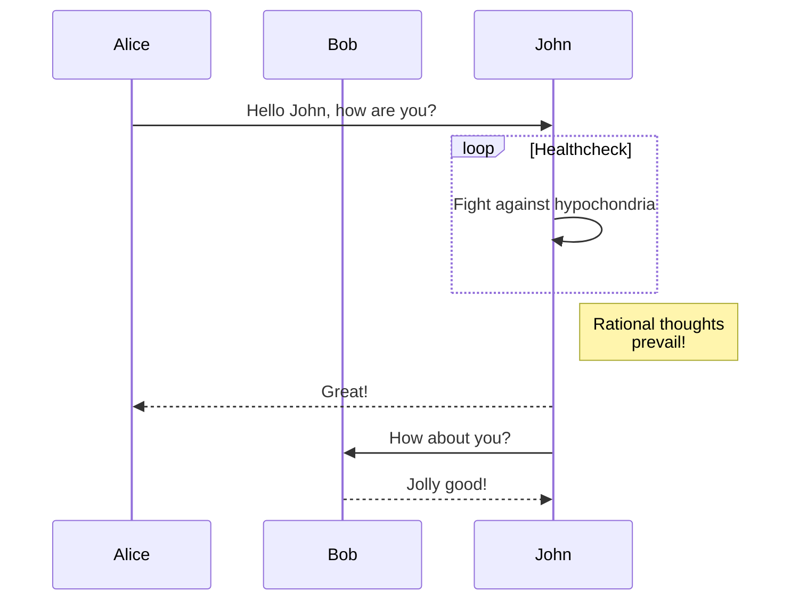

## Mermaid diagrams

Hugo does not provide a built-in template for Mermaid diagrams. Create your own using a [code block render hook][]:

```go-html-template {file="layouts/_markup/render-codeblock-mermaid.html" copy=true}
<pre class="mermaid">
  {{ .Inner | htmlEscape | safeHTML }}
</pre>
{{ .Page.Store.Set "hasMermaid" true }}
```

Then include this snippet at the _bottom_ of your base template, before the closing `body` tag:

```go-html-template {file="layouts/baseof.html" copy=true}
{{ if .Store.Get "hasMermaid" }}
  <script type="module">
    import mermaid from 'https://cdn.jsdelivr.net/npm/mermaid/dist/mermaid.esm.min.mjs';
    mermaid.initialize({ startOnLoad: true });
  </script>
{{ end }}
```

With that you can use the `mermaid` language in Markdown code blocks:

````md {file="content/example.md" copy=true}

````

